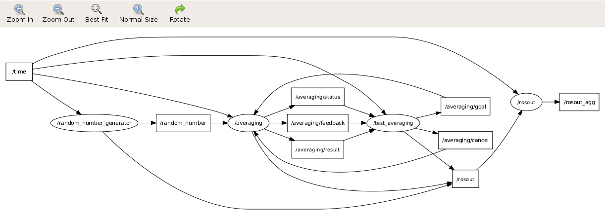

# actionlib intermediate tutorials

*- [actionlib tutorials 위키 페이지](http://wiki.ros.org/actionlib/Tutorials)*

## 1. Writing a Simple Action Server using the Goal Callback Method

다음은 wiki 페이지에 소개되어 있는 [Writing a Simple Action Server using the Goal Callback Method](http://wiki.ros.org/actionlib_tutorials/Tutorials/SimpleActionServer%28GoalCallbackMethod%29) 예제에 대한 내용이다.

### 1.1 Action Message
다음은 해당 예제에서 사용될 `.action`에 정의된 내용이다. 이 파일은 actionlib_tutorials/action/Averaging.action에 정의되어 있다.
```
#goal definition
int32 samples
---
#result definition
float32 mean
float32 std_dev
---
#feedback
int32 sample
float32 data
float32 mean
float32 std_dev
```

다음으로 CMakeLists.txt에는 다음과 같이 정의되어 있어야 빌드될 것이다.
```cmake
find_package(catkin REQUIRED COMPONENTS actionlib std_msgs message_generation) 
add_action_files(DIRECTORY action FILES Averaging.action)
generate_messages(DEPENDENCIES std_msgs actionlib_msgs)
```

### 1.2 Code
해당 [코드](https://github.com/ros/common_tutorials/blob/hydro-devel/actionlib_tutorials/src/averaging_server.cpp)는 Action Server의 역할을 하는 코드이다.

```cpp
#include <ros/ros.h>
#include <std_msgs/Float32.h>
#include <actionlib/server/simple_action_server.h>
#include <actionlib_tutorials/AveragingAction.h>

class AveragingAction
{
public:
    
  AveragingAction(std::string name) : 
    as_(nh_, name, false),
    action_name_(name)
  {
    //register the goal and feeback callbacks
    as_.registerGoalCallback(boost::bind(&AveragingAction::goalCB, this));
    as_.registerPreemptCallback(boost::bind(&AveragingAction::preemptCB, this));

    //subscribe to the data topic of interest
    sub_ = nh_.subscribe("/random_number", 1, &AveragingAction::analysisCB, this);
    as_.start();
  }

  ~AveragingAction(void)
  {
  }

  void goalCB()
  {
    // reset helper variables
    data_count_ = 0;
    sum_ = 0;
    sum_sq_ = 0;
    // accept the new goal
    goal_ = as_.acceptNewGoal()->samples;
  }

  void preemptCB()
  {
    ROS_INFO("%s: Preempted", action_name_.c_str());
    // set the action state to preempted
    as_.setPreempted();
  }

  void analysisCB(const std_msgs::Float32::ConstPtr& msg)
  {
    // make sure that the action hasn't been canceled
    if (!as_.isActive())
      return;
    
    data_count_++;
    feedback_.sample = data_count_;
    feedback_.data = msg->data;
    //compute the std_dev and mean of the data 
    sum_ += msg->data;
    feedback_.mean = sum_ / data_count_;
    sum_sq_ += pow(msg->data, 2);
    feedback_.std_dev = sqrt(fabs((sum_sq_/data_count_) - pow(feedback_.mean, 2)));
    as_.publishFeedback(feedback_);

    if(data_count_ > goal_) 
    {
      result_.mean = feedback_.mean;
      result_.std_dev = feedback_.std_dev;

      if(result_.mean < 5.0)
      {
        ROS_INFO("%s: Aborted", action_name_.c_str());
        //set the action state to aborted
        as_.setAborted(result_);
      }
      else 
      {
        ROS_INFO("%s: Succeeded", action_name_.c_str());
        // set the action state to succeeded
        as_.setSucceeded(result_);
      }
    } 
  }

protected:
    
  ros::NodeHandle nh_;
  actionlib::SimpleActionServer<actionlib_tutorials::AveragingAction> as_;
  std::string action_name_;
  int data_count_, goal_;
  float sum_, sum_sq_;
  actionlib_tutorials::AveragingFeedback feedback_;
  actionlib_tutorials::AveragingResult result_;
  ros::Subscriber sub_;
};

int main(int argc, char** argv)
{
  ros::init(argc, argv, "averaging");

  AveragingAction averaging(ros::this_node::getName());
  ros::spin();

  return 0;
}
```

* 먼저 의존성이 필요한 헤더들을 가져오고, action을 수행할 `simple_action_server.h`와 위에서 생성한 action 인터페이스 헤더인 `AveragingAction.h`를 가져온다.

```cpp
#include <ros/ros.h>
#include <std_msgs/Float32.h>
#include <actionlib/server/simple_action_server.h>
#include <actionlib_tutorials/AveragingAction.h>
```

* 다음으로 `AveragingAction` 클래스에 대한 정의이다. 생성자에서, Action Server 객체인 `as_`를 정의하고, Action Goal에 대한 callback 함수로 `goalCB`와, Action Server의 선점에 대한 callback 함수로 `preemptCB`를 등록한다.

```cpp
class AveragingAction
{
public:
    
  AveragingAction(std::string name) : 
    as_(nh_, name, false),
    action_name_(name)
  {
    //register the goal and feeback callbacks
    as_.registerGoalCallback(boost::bind(&AveragingAction::goalCB, this));
    as_.registerPreemptCallback(boost::bind(&AveragingAction::preemptCB, this));
```

* `/random_number`라는 토픽을 subscribe하면, `analysisCB` 함수를 호출하도록 정의하고, Action Server를 실행한다.

```cpp
    //subscribe to the data topic of interest
    sub_ = nh_.subscribe("/random_number", 1, &AveragingAction::analysisCB, this);
    as_.start();
  }
```

* `goalCB` 함수에 대한 정의이다. 해당 함수는 Action Goal에 대해 호출되며, goal을 저장하고, 다른 중요 변수들을 초기화한다.

```cpp
  void goalCB()
  {
    // reset helper variables
    data_count_ = 0;
    sum_ = 0;
    sum_sq_ = 0;
    // accept the new goal
    goal_ = as_.acceptNewGoal()->samples;
  }
```

* `preemptCB` 함수는 Action Server가 이전의 요청으로 선점되어 실행되고 있을 때, Action Goal에 대한 선점 정보를 콜백하는 함수이다.

```cpp
  void preemptCB()
  {
    ROS_INFO("%s: Preempted", action_name_.c_str());
    // set the action state to preempted
    as_.setPreempted();
  }
```

* `analysisCB` 함수는 `/random_number` 토픽을 subscribe 하면 호출되는 함수이다. 먼저 Action Server가 활성화 상태인지 확인한다.

```cpp
  void analysisCB(const std_msgs::Float32::ConstPtr& msg)
  {
    // make sure that the action hasn't been canceled
    if (!as_.isActive())
      return;
```

* 다음으로 feedback에 데이터를 저장하고, Action Server를 통해 `publishFeedback`으로 feedback을 반환한다.

```cpp
    data_count_++;
    feedback_.sample = data_count_;
    feedback_.data = msg->data;
    //compute the std_dev and mean of the data 
    sum_ += msg->data;
    feedback_.mean = sum_ / data_count_;
    sum_sq_ += pow(msg->data, 2);
    feedback_.std_dev = sqrt(fabs((sum_sq_/data_count_) - pow(feedback_.mean, 2)));
    as_.publishFeedback(feedback_);
```

* 또한 최종 결과값을 판단해, Abort 되면 `setAborted`로 result를 반환하고, Success 하면 `setSucceeded`로 result를 반환한다.

```cpp
    if(data_count_ > goal_) 
    {
      result_.mean = feedback_.mean;
      result_.std_dev = feedback_.std_dev;

      if(result_.mean < 5.0)
      {
        ROS_INFO("%s: Aborted", action_name_.c_str());
        //set the action state to aborted
        as_.setAborted(result_);
      }
      else 
      {
        ROS_INFO("%s: Succeeded", action_name_.c_str());
        // set the action state to succeeded
        as_.setSucceeded(result_);
      }
    } 
  }
```

* 다음은 `AveragingAction`에 선언된 `protected` 변수들로, 노드 핸들러와 action에 관련된 객체 등을 선언하였다.

```cpp
protected:
    
  ros::NodeHandle nh_;
  actionlib::SimpleActionServer<actionlib_tutorials::AveragingAction> as_;
  std::string action_name_;
  int data_count_, goal_;
  float sum_, sum_sq_;
  actionlib_tutorials::AveragingFeedback feedback_;
  actionlib_tutorials::AveragingResult result_;
  ros::Subscriber sub_;
};
```

* 메인함수에서 `AveragingAction` 클래스 객체를 생성하고 `ros::spin()`으로 무한루프를 생성한다.

```cpp
int main(int argc, char** argv)
{
  ros::init(argc, argv, "averaging");

  AveragingAction averaging(ros::this_node::getName());
  ros::spin();

  return 0;
}
```

## 2. Writing a Threaded Simple Action Client

다음은 [Writing a Threaded Simple Action Client](http://wiki.ros.org/actionlib_tutorials/Tutorials/SimpleActionClient%28Threaded%29) 예제로, 위에서 만든 Action Server와 통신하기 위한 Action Client이다. 이 Action Client는 목표 sample의 갯수를 Action Server에 요청하고 그 결괏값을 대기한다.

```cpp
#include <ros/ros.h>
#include <actionlib/client/simple_action_client.h>
#include <actionlib/client/terminal_state.h>
#include <actionlib_tutorials/AveragingAction.h>
#include <boost/thread.hpp>

void spinThread()
{
  ros::spin();
}

int main (int argc, char **argv)
{
  ros::init(argc, argv, "test_averaging");

  // create the action client
  actionlib::SimpleActionClient<actionlib_tutorials::AveragingAction> ac("averaging");
  boost::thread spin_thread(&spinThread);

  ROS_INFO("Waiting for action server to start.");
  ac.waitForServer();

  ROS_INFO("Action server started, sending goal.");
  // send a goal to the action
  actionlib_tutorials::AveragingGoal goal;
  goal.samples = 100;
  ac.sendGoal(goal);

  //wait for the action to return
  bool finished_before_timeout = ac.waitForResult(ros::Duration(30.0));

  if (finished_before_timeout)
  {
    actionlib::SimpleClientGoalState state = ac.getState();
    ROS_INFO("Action finished: %s",state.toString().c_str());
  }
  else
    ROS_INFO("Action did not finish before the time out.");

  // shutdown the node and join the thread back before exiting
  ros::shutdown();
  spin_thread.join();

  //exit
  return 0;
}
```

* 먼저 ros action client를 구현하기 위한 의존성 헤더들을 가져온다. `simple_action_client`는 action client를 구현하는데 필요한 라이브러리를 포함하고 있으며, `terminal_state.h`는 goal 상태를 정의하고 있다. 그리고, action 인터페이스 헤더인 `AveragingAction.h`를 가져오고, client에서 thread를 구현할 것이므로, `boost/thread.hpp`를 가져온다.

```cpp
#include <ros/ros.h>
#include <actionlib/client/simple_action_client.h>
#include <actionlib/client/terminal_state.h>
#include <actionlib_tutorials/AveragingAction.h>
#include <boost/thread.hpp>
```

* `spinThread` 함수를 정의한 것으로, ros node를 spin시킨다.

```cpp
void spinThread()
{
  ros::spin();
}
```

* 메인 함수에서 노드를 초기화하고, action client 객체를 초기화한다.

```cpp
int main (int argc, char **argv)
{
  ros::init(argc, argv, "test_averaging");

  // create the action client
  actionlib::SimpleActionClient<actionlib_tutorials::AveragingAction> ac("averaging");
```

* 다음으로 쓰레드를 동작시킨다.

```cpp
  boost::thread spin_thread(&spinThread);
```

* action server가 활성화가 될 때까지 대기한다.

```cpp
  ROS_INFO("Waiting for action server to start.");
  ac.waitForServer();
```

* action server가 활성화가 되었다면, goal을 action server에 보낸다.

```cpp
  ROS_INFO("Action server started, sending goal.");
  // send a goal to the action
  actionlib_tutorials::AveragingGoal goal;
  goal.samples = 100;
  ac.sendGoal(goal);
```

* action server로 부터 결과를 받는데 timeout 시간을 30초로 정의한다.

```cpp
  //wait for the action to return
  bool finished_before_timeout = ac.waitForResult(ros::Duration(30.0));
```

* 만약 timeout 전에 결괏값을 받았다면, result의 상태정보를 저장한다.

```cpp
  if (finished_before_timeout)
  {
    actionlib::SimpleClientGoalState state = ac.getState();
    ROS_INFO("Action finished: %s",state.toString().c_str());
  }
  else
    ROS_INFO("Action did not finish before the time out.");
```

* 노드를 종료하고, 쓰레드를 종료시킨다.

```cpp
  // shutdown the node and join the thread back before exiting
  ros::shutdown();
  spin_thread.join();

  //exit
  return 0;
}
```

## 3. Running an Action Server and Client with Other Nodes

다음은 [Running an Action Server and Client with Other Nodes](http://wiki.ros.org/actionlib_tutorials/Tutorials/RunningServerAndClientWithNodes) 예제로, Action Server에서 분석하기 위해 필요한 `/random_number` 토픽값을 생성하는 노드이다.

```python
#!/usr/bin/env python

import rospy
from std_msgs.msg import Float32
import random
def gen_number():
    pub = rospy.Publisher('random_number', Float32)
    rospy.init_node('random_number_generator', log_level=rospy.INFO)
    rospy.loginfo("Generating random numbers")

    while not rospy.is_shutdown():
        pub.publish(Float32(random.normalvariate(5, 1)))
        rospy.sleep(0.05)

if __name__ == '__main__':
  try:
    gen_number()
  except Exception, e:
    print "done"
```

## 4. 실행

### 4.1 Action Server

```bash
rosrun actionlib_tutorials averaging_server
```

Action Server의 topic list는 다음과 같다.

```bash
Published topics:
 * /averaging/status [actionlib_msgs/GoalStatusArray] 1 publisher
 * /averaging/result [actionlib_tutorials/AveragingActionResult] 1 publisher
 * /averaging/feedback [actionlib_tutorials/AveragingActionFeedback] 1 publisher
 * /rosout [roslib/Log] 1 publisher
 * /rosout_agg [roslib/Log] 1 publisher

Subscribed topics:
 * /time [unknown type] 2 subscribers
 * /rosout [roslib/Log] 1 subscriber
 * /averaging/goal [unknown type] 1 subscriber
 * /averaging/cancel [unknown type] 1 subscriber
```

### 4.2 Action Client

```bash
rosrun actionlib_tutorials averaging_client
```

Action Client의 topic list는 다음과 같다.

```bash
Published topics:
 * /averaging/goal [actionlib_tutorials/AveragingActionGoal] 1 publisher
 * /averaging/cancel [actionlib/GoalID] 1 publisher
 * /rosout [roslib/Log] 1 publisher
 * /rosout_agg [roslib/Log] 1 publisher

Subscribed topics:
 * /time [unknown type] 2 subscribers
 * /rosout [roslib/Log] 1 subscriber
 * /averaging/feedback [unknown type] 1 subscriber
 * /averaging/status [unknown type] 1 subscriber
 * /averaging/result [unknown type] 1 subscriber
```

### 4.3 Action Node

```bash
rosrun actionlib_tutorials gen_numbers.py 
```

Action Server에서 feddback과 result 값을 다음과 같이 확인할 수 있다.

```bash
rostopic echo /averaging/feedback
rostopic echo /averaging/result
```

결괏값
```bash
# feedback
---
header: 
  seq: 1
  stamp: 1251489509536852000
  frame_id: 
status: 
  goal_id: 
    stamp: 1251489509511553000
    id: 1251489509.511553000
  status: 1
  text: 
feedback: 
  sample: 1
  data: 3.96250081062
  mean: 3.96250081062
  std_dev: 0.000687940046191
---
header: 
  seq: 2
  stamp: 1251489509588828000
  frame_id: 
status: 
  goal_id: 
    stamp: 1251489509511553000
    id: 1251489509.511553000
  status: 1
  text: 
feedback: 
  sample: 2
  data: 5.16988706589
  mean: 4.56619405746
  std_dev: 0.60369348526
---

# result
---
header: 
  seq: 1
  stamp: 1251489786993936000
  frame_id: 
status: 
  goal_id: 
    stamp: 1251489781746524000
    id: 1251489781.746524000
  status: 4
  text: 
result: 
  mean: 4.99936008453
  std_dev: 1.10789334774
```

### 4.4 rqt graph

rqt graph를 띄우면 다음과 같다.

```
rqt_graph
```


