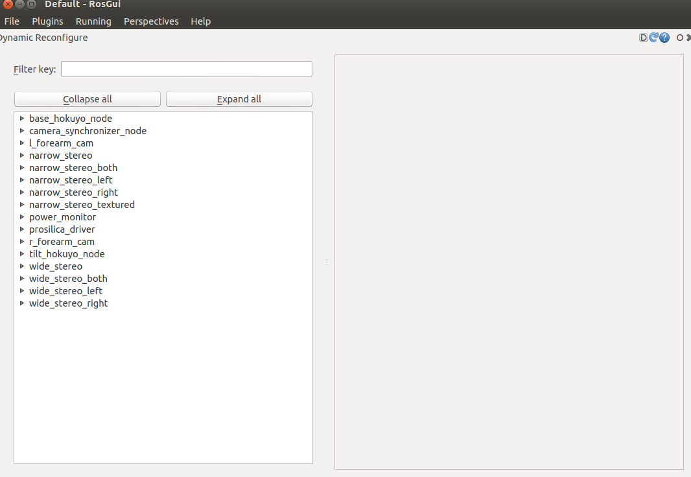

# dynamic reconfigure

*- [dynamic_reconfigure 위키 페이지](http://wiki.ros.org/dynamic_reconfigure)*

*- [dynamic_reconfigure Tutorials 위키 페이지](http://wiki.ros.org/dynamic_reconfigure/Tutorials)*

*- [rqt_reconfigure 위키 페이지](http://wiki.ros.org/rqt_reconfigure)*

## 1. dynamic_reconfigure
dynamic_reconfigure은 실행 중인 ROS 노드의 파라미터를 외부 인터페이스를 이용하여 실시간으로 변경할 수 있게 한다.

## 2. Utilities
dynamic_reconfigure 파라미터를 수정하는 방법은 크게 두 가지 방법이 있다.

### 2.1 reconfigure GUI
rqt_reconfigure을 이용하는 방법으로, 실행 방법은 다음과 같다.

```bash
rosrun rqt_reconfigure rqt_reconfigure
```
실행하면 다음과 같은 rqt 화면이 뜨고,

다음과 같이 gui 인터페이스로 파라미터를 조절할 수 있다.


### 2.2 dynparam command-line tool
dynparam 명령으로 reconfigure을 할 수 있으며, 명령어는 다음과 같다.

```bash
rosrun dynamic_reconfigure dynparam COMMAND
```

`COMMAN`의 종류는 다음과 같다.
* list : reconfigure이 가능한 node의 리스트를 보여줌
```bash
rosrun dynamic_reconfigure dynparam list
```
* get node_name : node_name에 해당하는 configure을 가져옴
```bash
rosrun dynamic_reconfigure dynparam get /node
```
* set node_name parameter_name parameter_value : parameter set
```bash
rosrun dynamic_reconfigure dynparam set /node parameter_name value
```
* set node_name yaml_dictionary : yaml dictionary 형태로 한 번에 여러 개의 파라미터를 설정
```bash
rosrun dynamic_reconfigure dynparam set wge100_camera "{'camera_url':'foo', 'brightness':58}" 
```
* set_from_parameters node_name : parameter 서버로부터 해당 노드의 configuration을 로드함
```bash
rosrun dynamic_reconfigure dynparam set_from_parameters /node
```
* dump node_name file.yaml : file.yaml 파일에 해당 노드의 configuration을 dump함
```bash
rosrun dynamic_reconfigure dynparam dump /node dump.yaml
```
* load node_name file.yaml : file.yaml 파일에 있는 configuration을 해당 노드에 로드함
```bash
rosrun dynamic_reconfigure dynparam load /node dump.yaml
```

## 3. Tutorials

### 3.1 How to Write Your First .cfg File
먼저 dynamic_reconfigure을 하기 위해 .cfg file을 생성해야 한다.

```python
#!/usr/bin/env python
PACKAGE = "dynamic_tutorials"

from dynamic_reconfigure.parameter_generator_catkin import *

gen = ParameterGenerator()

gen.add("int_param",    int_t,    0, "An Integer parameter", 50,  0, 100)
gen.add("double_param", double_t, 0, "A double parameter",    .5, 0,   1)
gen.add("str_param",    str_t,    0, "A string parameter",  "Hello World")
gen.add("bool_param",   bool_t,   0, "A Boolean parameter",  True)

size_enum = gen.enum([ gen.const("Small",      int_t, 0, "A small constant"),
                       gen.const("Medium",     int_t, 1, "A medium constant"),
                       gen.const("Large",      int_t, 2, "A large constant"),
                       gen.const("ExtraLarge", int_t, 3, "An extra large constant")],
                     "An enum to set size")

gen.add("size", int_t, 0, "A size parameter which is edited via an enum", 1, 0, 3, edit_method=size_enum)

exit(gen.generate(PACKAGE, "dynamic_tutorials", "Tutorials"))
```

.cfg 파일은 python으로 구성이 되어있으며, PACKAGE 이름을 작성하고, `dynamic_reconfigure.parameter_generator_catkin`을 가져온다.
```python
#!/usr/bin/env python
PACKAGE = "dynamic_tutorials"

from dynamic_reconfigure.parameter_generator_catkin import *
```

`ParameterGenerator()`은 파라미터를 정의하는 객체를 생성하는 함수이다. 이 함수로 생성된 객체는 `add()`함수로 파라미터를 생성한다.
```python
gen = ParameterGenerator()

gen.add("int_param",    int_t,    0, "An Integer parameter", 50,  0, 100)
gen.add("double_param", double_t, 0, "A double parameter",    .5, 0,   1)
gen.add("str_param",    str_t,    0, "A string parameter",  "Hello World")
gen.add("bool_param",   bool_t,   0, "A Boolean parameter",  True)
```
다음은 `add()`함수의 인자이다.
* name : param 이름
* paramtype : param 자료형
* level : bitmask로, dynamic reconfigure이 callback 시 해당 parameter 값은 해당 level로 `or`되어 전달된다.
* description : param 설명
* default : param 기본 값
* min : param 최솟값
* max : param 최댓값

아래의 코드는 `enum` 구조의 파라미터를 생성하는 예시이다.`gen.enum()`함수를 이용하여 상수 목록을 만들고, 이를 `add()` 생성자를 이용하여 파라미터를 생성한다.
```python
size_enum = gen.enum([ gen.const("Small",      int_t, 0, "A small constant"),
                       gen.const("Medium",     int_t, 1, "A medium constant"),
                       gen.const("Large",      int_t, 2, "A large constant"),
                       gen.const("ExtraLarge", int_t, 3, "An extra large constant")],
                     "An enum to set size")

gen.add("size", int_t, 0, "A size parameter which is edited via an enum", 1, 0, 3, edit_method=size_enum)
```

마지막 라인의 `exit()`함수는 `gen.generate()`함수를 이용하여 해당 PACKAGE의 파일을 생성하고 종료하는 명령이다. `gen.generate()`함수의 두 번째 매개변수는 실행 시 사용되는 노드 이름이며, 세 번째 매개변수는 이 생성된 파일을 가져올 때 사용되는 prefix이다.(예: [name]Config.h 또는 [name]Config.py)
```python
exit(gen.generate(PACKAGE, "dynamic_tutorials", "Tutorials"))
```

다음으로 .cfg 파일을 실행하능하게 하기 위하여 다음의 명령을 사용한다.
```bash
chmod a+x cfg/Tutorials.cfg
```
그리고 CMakeLists.txt에 추가한다.
```cmake
#add dynamic reconfigure api
#find_package(catkin REQUIRED dynamic_reconfigure)
generate_dynamic_reconfigure_options(
  cfg/Tutorials.cfg
  #...
)

# make sure configure headers are built before any node using them
add_dependencies(example_node ${PROJECT_NAME}_gencfg)
```

### 3.2 Setting up Dynamic Reconfigure for a Node (python)
Python 노드에서 dynamic_reconfigure을 적용하는 방법을 볼 것이다.
```python
#!/usr/bin/env python

import rospy

from dynamic_reconfigure.server import Server
from dynamic_tutorials.cfg import TutorialsConfig

def callback(config, level):
    rospy.loginfo("""Reconfigure Request: {int_param}, {double_param},\ 
          {str_param}, {bool_param}, {size}""".format(**config))
    return config

if __name__ == "__main__":
    rospy.init_node("dynamic_tutorials", anonymous = False)

    srv = Server(TutorialsConfig, callback)
    rospy.spin()
```

처음에 `rospy` 및 `dynamic_reconfigure.server` 클래스를 가져오고, 앞서 만든 `dynamic_tutorials.cfg`의 `TutorialsConfig`를 가져온다. 
```python
#!/usr/bin/env python

import rospy

from dynamic_reconfigure.server import Server
from dynamic_tutorials.cfg import TutorialsConfig
```

다음은 `callback()`함수의 정의로, dynamic_reconfigure이 실행되면 수행되는 callback 함수이다. 여기서는 callback 시 간단하게 config에 대한 업데이트를 출력하는 것이 구현되어 있다. 만약 해당 config의 parameter로 해당 노드의 parameter를 변경하고자 할 때, config에 해당하는 parameter를 현재 노드의 parameter에 대입하면 된다.
```python
def callback(config, level):
    rospy.loginfo("""Reconfiugre Request: {int_param}, {double_param},\ 
          {str_param}, {bool_param}, {size}""".format(**config))
    return config
```

마지막으로 노드를 초기화 하고, 콜백 기능을 구현한 부분이다.
```python
if __name__ == "__main__":
    rospy.init_node("dynamic_tutorials", anonymous = False)

    srv = Server(TutorialsConfig, callback)
    rospy.spin()
```
### 3.3 Setting up Dynamic Reconfigure for a Node (cpp)
Cpp 노드에서 dynamic_reconfigure을 적용하는 방법을 볼 것이다.
```cpp
#include <ros/ros.h>

#include <dynamic_reconfigure/server.h>
#include <dynamic_tutorials/TutorialsConfig.h>

void callback(dynamic_tutorials::TutorialsConfig &config, uint32_t level) {
  ROS_INFO("Reconfigure Request: %d %f %s %s %d", 
            config.int_param, config.double_param, 
            config.str_param.c_str(), 
            config.bool_param?"True":"False", 
            config.size);
}

int main(int argc, char **argv) {
  ros::init(argc, argv, "dynamic_tutorials");

  dynamic_reconfigure::Server<dynamic_tutorials::TutorialsConfig> server;
  dynamic_reconfigure::Server<dynamic_tutorials::TutorialsConfig>::CallbackType f;

  f = boost::bind(&callback, _1, _2);
  server.setCallback(f);

  ROS_INFO("Spinning node");
  ros::spin();
  return 0;
}
```

먼저 dynamic_reconfigure에 필요한 헤더파일과, 앞서 정의한 TutorialsConfig 헤더파일을 가져온다.
```cpp
#include <ros/ros.h>

#include <dynamic_reconfigure/server.h>
#include <dynamic_tutorials/TutorialsConfig.h>
```

다음은 `callback()`함수에 대한 정의로, dynamic_reconfigure이 수행될 때 callback되는 함수이다. `config` 인자는 적용하고자 하는 configuration이고, `level`은 변경된 파라미터의 모든 레벨 값을 `or` 연산으로 계산된 결과이다. 여기서는 새로운 config에 대해 출력하는 역할을 수행한다. 만약 해당 config의 parameter로 해당 노드의 parameter를 변경하고자 할 때, config에 해당하는 parameter를 현재 노드의 parameter에 대입하면 된다.
```cpp
void callback(dynamic_tutorials::TutorialsConfig &config, uint32_t level) {
  ROS_INFO("Reconfigure Request: %d %f %s %s %d", 
            config.int_param, config.double_param, 
            config.str_param.c_str(), 
            config.bool_param?"True":"False", 
            config.size);
}
```

`main()`함수에서 우리가 원하는 configuration 형태의 dynamic_reconfigure server를 정의한다.
```cpp
int main(int argc, char **argv) {
  ros::init(argc, argv, "dynamic_tutorials");

  dynamic_reconfigure::Server<dynamic_tutorials::TutorialsConfig> server;
```

다음으로 callback을 호출하는 변수를 선언하고, 이를 `setCallback()`함수를 이용하여 dynamic_reconfigure이 수행되면 해당 server에서 callback을 수행한다.
```cpp
  dynamic_reconfigure::Server<dynamic_tutorials::TutorialsConfig>::CallbackType f;

  f = boost::bind(&callback, _1, _2);
  server.setCallback(f);
```

마지막으로 `ros::spin()`함수를 이용하여 해당 노드를 지속시킨다.
```cpp
  ROS_INFO("Spinning node");
  ros::spin();
  return 0;
}
```