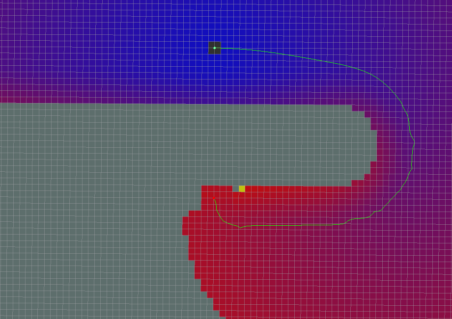

# global_planner

## 0. 참고 문헌

*- [global_planner 위키 페이지](http://wiki.ros.org/global_planner?distro=noetic)*

## 1. global_planner
로봇의 시작 위치로부터 목표 위치까지의 경로를 생성하기 위해 nav_core::BaseGlobalPlanner 인터페이스를 이용하여 구현된 글로벌 플래너이다.

## 2. global_planner 종류

global_planner는 파라미터 설정에 따라 구현되어 있는 global_planner를 가져와 사용할 수 있으며, 이는 [navFn](http://wiki.ros.org/navfn)을 기반으로 유연하게 global_planner을 구현할 수 있다.

### 2.1 Standard Behavior
Standard Behavior는 모든 파라미터를 default로 설정했을 때의 global_planner이다.


### 2.2 Grid Path
그리드의 경계를 따라 경로가 생성된다.
```bash
use_grid_path=True
```


### 2.3 Simple Potential Calculation
navFn의 potential 계산 방법을 Quadratic하게 구현하지 않고, 단순화하여 계산하는 방법이다.
```bash
use_quadratic=False
```


### 2.4 A*
A* 알고리즘은 주어진 출발지에서, 목적지까지 가는 최단 경로를 찾아내기 위한 알고리즘이다다. A* 알고리즘은 완전한 최단 경로를 찾지 않고 최단 경로의 근사값을 찾아내는 것을 목표로 한다.
```bash
use_dijkstra=False
```


### 2.5 Dijkstra
Dijkstra 알고리즘도 A* 알고리즘과 마찬가지로 최단 경로를 찾아내기 위한 알고리즘으로, A*와 다르게 완전한 최단 경로를 찾는 것을 목표로 한다.
```bash
use_dijkstra=True
```


### 2.6 Old NavFn Behavior
이 글로벌 플래너는 다음과 같은 특징을 가ㅌ는다.
* 경로의 시작이 실제 시작 위치와 일치하지 않습니다.
* 경로의 맨 끝은 그리드 선을 따라 이동합니다.
* 모든 좌표가 반 격자 셀만큼 약간씩 움직인다.

```bash
old_navfn_behavior=True
```


## 3. Orientation Filter
글로벌 플래너 생성 이후 후처리 과정으로 경로 상의 점에 방향을 추가할 수 있다. ~orientation_mode 파라미터를 통해 아래와 같은 방향 모드를 설정할 수 있다.
* None=0 : 방향 추가 없음
* Forward=1 : 마지막 목표 방향을 제외한, 경로의 +x 방향으로 방향 지정
* Interpolate=2 : 시작 방향과 목표 방향의 인터폴레이션 이용하여 방향 지정
* ForwardThenInterpolate=3 : 직선 경로에서는 Foward 이용, 그 이후는 Interpolate 이용
* Backward=4 : 마지막 목표 방향을 제외한, 경로의 -x 방향으로 방향 지정 
* Leftward=5 : 마지막 목표 방향을 제외한, 경로의 +y 방향으로 방향 지정 
* Rightward=6 : 마지막 목표 방향을 제외한, 경로의 -y 방향으로 방향 지정

## 4. Published Topics
1. ~[name]/plan ([nav_msgs/Path](http://docs.ros.org/en/api/nav_msgs/html/msg/Path.html)) : 마지막으로 계산된 경로로, 주로 visualization 목적으로 사용

## 5. Parameters
parameter 설정에 따라 global_planner를 커스터마이징 할 수 있다. 자세한 parameter 내용은 [global_planner 위키 페이지](http://wiki.ros.org/global_planner?distro=noetic)를 참조