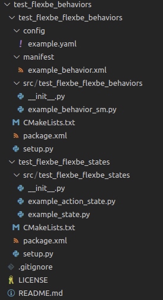
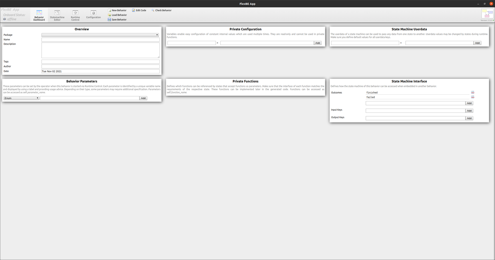
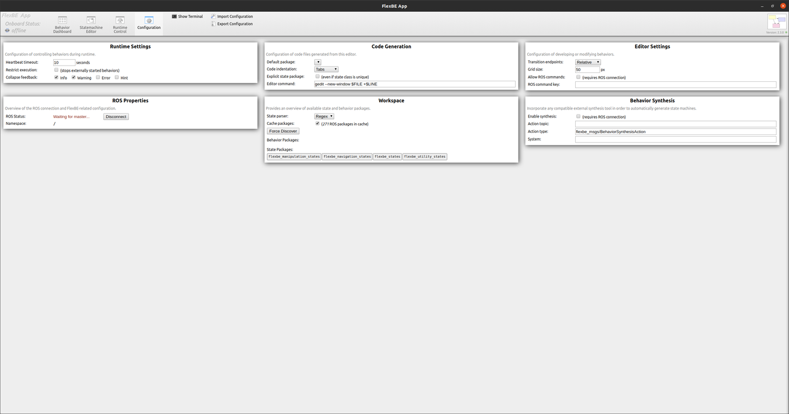
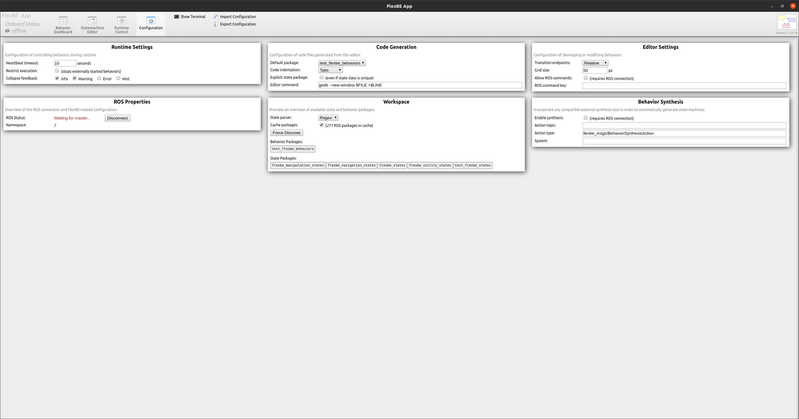

# Installation

## 0. 참고 문헌

*- [FlexBe 홈페이지](http://philserver.bplaced.net/fbe/)*

*- [FlexBe ROS 위키 페이지](http://wiki.ros.org/flexbe)*

*- [FlexBe Behavior Engine Github](https://github.com/team-vigir/flexbe_behavior_engine)*

*- [FlexBe App Github](https://github.com/FlexBE/flexbe_app)*

*- [FlexBe States Github](https://github.com/FlexBE/generic_flexbe_states)*

*- [FlexBe example Github](https://github.com/team-vigir/vigir_behaviors/tree/master/vigir_flexbe_launch)*

## 1. FlexBe 설치
catkin_ws를 만들고, flexbe behavior engine, flebe app, flexbe states 레포지토리를 각각 클론하여 받아온다.
```bash
cd ~/catkin_ws/src

# CLONE
git clone https://github.com/team-vigir/flexbe_behavior_engine.git
git clone https://github.com/FlexBE/flexbe_app.git
git clone https://github.com/FlexBE/generic_flexbe_states.git

# BUILD
cd ~/catkin_ws
catkin_make
```

## 2. FlexBe Repository 생성
아래의 예시는 `your_project_name_behaviors` 이름으로 repository 생성하는 것으로, repo 생성 시 생성 위치가 src 폴더 아래에 잘 생성되있는지 확인 필요하다.
```bash
cd ~/catkin_ws/src
rosrun flexbe_widget create_repo [your_project_name]

# BUILD
cd ~/catkin_ws
catkin_make
```

FlexBe Repository를 생성하면 다음과 같이 생성된다.


## 3. FlexBe App 실행
다음의 실행 명령으로 flexbe app을 실행할 수 있다.
```bash
rosrun flexbe_app run_app
```

최초 실행 시 다음과 같은 flexbe app 화면을 볼 수 있다.


처음 실행하게 되면 앞서 생성한 behavior repository가 나타나지 않는데, [Configuration] 탭에서 [Workspace] 패널의 [Force Discover]를 누르면 현재 workspace에 생성되어 있는 behavior repository를 가져온다.



