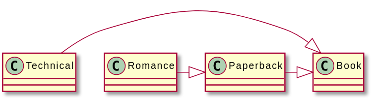

# Respect Your Parents

* 참고문헌 : 전문가를 위한 C++(마크 그레고리 / 한빛미디어)

## 1. 부모 클래스의 생성자

객체는 한번에 생성되지 않는다. 부모에 있던 것과 새로 추가할 내용을 모두 담아서 생성한다. C++는 객체 생성 과정을 다음과 같이 정의한다.

1. 베이스 클래스라면 디폴트 생성자를 실행한다. 단, 생성자 이니셜라이저가 있다면 디폴트 생성자 대신 생성자 이니셜라이저를 호출한다.
2. static으로 선언하지 않은 데이터 멤버를 코드에 나타난 순서대로 생성한다.
3. 클래스 생성자의 본문을 실행한다.

이 규칙은 재귀적으로 적용된다. 클래스에 부모 클래스가 있다면 현재 클래스보다 부모 클래스를 먼저 초기화한다.

## 2. 부모 클래스의 소멸자

소멸자는 인수를 받지 않기 때문에 부모 클래스의 소멸자는 언제나 자동으로 호출되게 할 수 있다. 소멸자의 호출 과정은 다음과 같이 생성자와 반대다.

1. 현재 클래스의 소멸자를 호출한다.
2. 현재 클래스의 데이터 멤버를 생성할 때와 반대 순서로 삭제한다.
3. 부모 클래스가 있다면 부모의 소멸자를 호출한다.

이 규칙도 생성자와 마찬가지로 재귀적으로 적용된다. 상속 체인의 가장 하위멤버를 먼저 삭제한다.

> 소멸자 앞에는 항상 virtual을 붙인다. 컴파일러가 생성한 디폴트 소멸자는 virtual이 아니므로 최소한 부모 클래스에서만이라도 virtual 소멸자를 따로 정의하거나 명시적으로 default로 지정한다.

## 3. 부모 클래스 참조하기

파생 클래스에서 부모 클래스의 메서드를 호출하려면 부모 클래스의 스코프 지정 연산자를 추가해야 한다.

예를 들어 MyWeatherPrediction 클래스에서 WeatherPrediction 클래스의 getTemperature() 메서드를 오버라이드한 경우에, MyWeatherPrediction::getTemperature()의 구현 코드에서 부모 클래스의 getTemperature()를 호출하려면 다음과 같이 작성해야 한다.

```cpp
string MyWeatherPrediction::getTemperature() const
{
    return WeatherPrediction::getTemperature() + "\u00B0F";
}
```

또 다른 예로 다음과 같은 클래스 계층을 갖는 경우를 생각해보자.



이 계층은 파생될수록 구체화되기 때문에 어떤 책에 대한 정보를 가져오려면 베이스 클래스부터 현재 클래스까지 담긴 내용을 모두 가져와야 한다. 이 기능은 부모 메서드를 호출하는 패턴으로 구현할 수 있다.

```cpp
class Book
{
    public:
        virtual ~Book() = default;
        virtual string getDescription() const { return "Book"; }
        virtual int getHeight() const { return 120; }
};

class Paperback : public Book
{
    public:
        virtual string getDescription() const override {
            return "Paperback " + Book:getDescription();
        }
};

class Romance : public Paperback
{
    public:
        virtual string getDescription() const override {
            return "Romance " + Paperback::getDescription();
        }
        virtual int getHeight() const override {
            return Paperback::getHeight() / 2;
        }
};

class Technical : public Book
{
    public:
        virtual string getDescription() const override {
            return "Technical " + Book::getDescription();
        }
};

int main()
{
    Romance novel;
    Book book;
    cout << novel.getDescription() << endl; // 결과: "Romance Paperback Book"
    cout << book.getDescription() << endl; // 결과: "Book"
    cout << novel.getHeight() << endl; // 결과: "60"
    cout << book.getHeight() << endl; // 결과: "120"
    return 0;
}
```

> 이 예제에서 Paperback::getHeight()를 호출한 부분은 Paperback 클래스에서 getHeight()를 오버라이드하지 않았기 때문에 Book::getHeight()를 호출한다.

## 4. 업캐스팅과 다운캐스팅

### 4.1 업캐스팅

객체를 부모 클래스 타입으로 캐스팅하거나 대입할 수 있다. 기존 객체를 캐스팅하거나 대입하면 (자식 클래스의 특성이 사라지는) 슬라이싱이 발생한다.

```cpp
Base myBase = myDerived; // 슬라이싱 발생
```

Base 객체에는 Derived 클래스에 정의된 부가 기능이 없기 때문에 최종 결과가 Base 객체라면 슬라이싱 현상이 발생한다.

하지만 파생 클래스 타입의 객체를 베이스 클래스 타입의 포인터나 레퍼런스에 대입할 때는 슬라이싱이 발생하지 않는다.

```cpp
Bas& myBase = myDerived; // 슬라이싱이 발생하지 않는다.
```

이렇게 베이스 클래스 타입으로 파생 클래스를 참조하는 것을 업캐스팅이라고 한다. 이 때문에 객체가 아닌 객체의 레퍼런스를 함수나 메서드로 전달하도록 구성하는 것이 좋다. 레퍼런스를 활용하면 슬라이싱 없이 파생 클래스를 전달할 수 있다.

### 4.2 다운캐스팅

반면 베이스 클래스를 파생 클래스로 캐스팅하는 것을 다운캐스팅이라고 부르는데, 이렇게 하면 해당 객체가 반드시 파생 클래스에 속한다고 보장할 수 없고, 다운캐스팅이 있다는 것은 디자인이 잘못된 것을 의미한다.

```cpp
void presumptuous(Base* base)
{
    Derived* myDerived = static_cast<Derived*>(base);
    // myDerived로 Derived의 메서드에 접근하는 코드를 작성한다.
}
```

위 예제에서 presumptuous()를 작성한 사람이 이를 호출하는 코드를 작성할 때는 아무런 문제없다. 이 함수에서 Derived* 타입의 인수를 받는다는 것을 알고 있기 때문이다. 하지만 다른 프로그래머가 이 메서드를 호출할 때는 Base* 타입의 인수를 전달할 가능성이 있다. 인수의 구체적인 타입을 컴파일 시간에 결정할 수 없기 때문에 이 함수는 막연히 base가 Derived에 대한 포인터라고 간주한다.

##### dynamic_cast()

다운캐스팅이 필요한 경우에는 완벽히 통제할 수 있는 상황에서만 사용해야 한다. 다운캐스팅을 할 때는 반드시 dynamic_cast()를 호출해야 한다. 이 함수는 객체 내부에 저장된 타입 정보를 보고 캐스팅이 잘못됐다면 처리하지 않는다. dynamic_cast()는 virtual 멤버가 하나라도 있는 객체에만 적용할 수 있으며, 포인터 변수에 대해 dynamic_cast()가 실패하면 포인터의 값은 nullptr가 된다. 또한 객체 레퍼런스에 대해 dynamic_cast()가 실패하면 std::bad_cast 익셉션이 발생한다.

```cpp
void lessPresumptuous(Base* base)
{
    Derived* myDerived = dynamic_cast<Derived*>(base);
    if(myDerived != nullptr){
        // myDerived로 Derived의 메서드에 접근하는 코드를 작성한다.
    }
}
```

> 다운캐스팅하는 하는 경우는 디자인이 잘못되었을 때 나타나곤 한다. 이럴 때는 다운캐스팅을 사용할 일이 없도록 디자인을 다시한다.