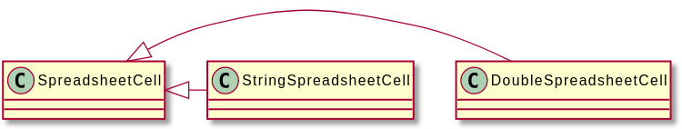

# Inheritance For Polymorphism

* 참고문헌 : 전문가를 위한 C++(마크 그레고리 / 한빛미디어)

## 1. 스프레드시트 예제

상속의 가장 강력한 기능인 다형성에 대한 설명을 위해 앞선 예제에서 만든 SpreadsheetCell 코드를 사용한다.

```cpp
class SpreadsheetCell
{
    public:
        virtual void set(double inDouble);
        virtual void set(std::string_view inString);
        virtual std::string getString() const;
    private:
        static std::string doubleToString(double inValue);
        static double stringToDouble(std::string_view inString);
        double mValue;
};
```

SpreadsheetCell은 데이터를 구성하는 원소를 double 값으로 저장했다. 여기서 셀을 double과 string 중 아무 값으로 지정할 수 있지만, 내부적으로는 항상 double로 저장한다. 하지만 현재 셀의 값을 리턴할 때는 항상 string으로 표현한다.

이 SpreadsheetCell을 이용하여 셀에 다양한 종류의 값(문장, 수식, 날짜 등)을 저장할 수 있도록 만들고자 한다.

## 2. 다형성을 지원하는 스프레드시트 셀 디자인하기

현재 상태의 SpreadsheetCell 클래스는 너무 비대해서 계층화를 하고자 한다. SpreadsheetCell의 계층 구조를 다형성을 활용하도록 디자인하기 위해 string만을 담을 수 있는 StringSpreadsheetCell과 double을 저장하는 DoubleSpreadsheetCell을 파생클래스로 만든다.



이 디자인의 특성은 다음과 같다.
* 두 파생 클래스 모두 베이스 클래스에서 정의한 인터페이스를 똑같이 제공한다.
* SpreadsheetCell 객체를 사용하는 코드는 현재 셀 객체의 타입이 DoubleSpreadsheetCell인지 아니면 StringSpreadsheetCell인지 신경 쓸 필요 없이 SpreadsheetCell에 정의된 인터페이스를 마음껏 호출할 수 있다.
* virtual 메커니즘을 통해 공통 인터페이스의 메서드 중에서 가장 적합한 버전을 호출해준다.
* 다른 데이터 구조도 부모 클래스 타입을 참조하는 방식으로 여러 타입으로 된 셀을 하나로 묶을 수 있다.

## 3. SpreadsheetCell 베이스 클래스

스프레드시트를 구성하는 셀은 모두 SpreadsheetCell이라는 베이스 클래스를 상속하므로 이 클래스부터 정의하는 것이 바람직하다.

베이스 클래스를 디자인할 때는 이를 상속하는 여러 파생 클래스 사이의 관계부터 분석한다. 여기서 도출된 공통 정보를 토대로 부모 클래스의 구성 요소를 결정한다.

string 타입의 셀과 double 타입의 셀은 모두 테이터 항목 하나를 표현한다는 공통점이 있다. 이 데이터를 사용자로부터 받아서 다시 사용자에게 출력하기 때문에 값을 string 타입으로 저장하고 불러오는 것이 적합하다. 이 동작이 베이스 클래스를 구성할 공통 기능이다.

### 3.1 첫 번째 버전

SpreadsheetCell 클래스에 파생 클래스에 제공할 공통 동작을 정의한다. 모든 셀이 값을 string 타입으로 저장하고, 현재 지정된 값을 리턴할 때도 string으로 표현한다. 베이스 클래스를 정의하는 코드는 이에 관련된 메서드 뿐만 아니라 명시적으로 디폴트로 선언한 virtual 소멸자도 선언해야 한다. 여기서 데이터 멤버를 정의하지 않는 점을 주목한다.

```cpp
class SpreadsheetCell
{
    public:
        virtual ~SpreadsheetCell() = default;
        virtual void set(std::string_view inString);
        virtual std::string getString() const;
};
```

### 3.2 순수 가상 메서드와 추상 베이스 클래스

파생 클래스에서 제공할 동작을 실제로 구현하지 않은 상태에서 이에 대한 동작을 부모 클래스에서 선언하기 위해 순수 가상 메서드로 정의한다. 순수 가상 메서드란 클래스 정의 코드에서 명시적으로 정의하지 않는 메서드다. 이 메서드에 대하여 컴파일러는 정의가 현재 클래스에 없다고 판단한다.

순수 가상 메서드를 지정하려면 메서드 선언 뒤에 `=0`을 붙인다. 그리고 구현 코드는 작성하지 않는다.

```cpp
class SpreadsheetCell
{
    public:
        virtual ~SpreadsheetCell() = default;
        virtual void set(std::string_view inString) = 0;
        virtual std::string getString() const = 0;
};
```

순수 가상 메서드가 최소 하나 이상 정의된 클래스를 추상 클래스라 부른다. 추상 클래스에 대해서는 인스턴스를 만들 수 없다. 따라서 다음과 같이 추상 클래스인 SPreadsheetCell의 객체를 생성하면 컴파일 에러가 발생한다.

```cpp
SpreadsheetCell cell;
```

하지만 StringSpreadsheetCell 클래스를 구현한 후 다음과 같이 작성하면 객체를 추상 베이스 클래스가 아닌 파생 클래스 타입으로 생성하기 때문에 컴파일 에러가 발생하지 않는다.

```cpp
std::unique_ptr<SpreadsheetCell> cell(new StringSpreadsheetCell());
```

## 4. 파생 클래스 구현하기

StringSpreadsheetCell과 DoubleSpreadsheetCell 클래스를 정의할 때는 부모 클래스에 정의된 기능을 그대로 구현하면 된다.

이 클래스들은 부모 클래스로부터 받은 순수 가상 메서드를 하나도 빠짐없이 구현해야 한다. 베이스 클래스에서 순수 가상으로 정의한 메서드 중 파생 클래스에서 구현하지 않은 것이 하나라도 있으면 파생 클래스도 추상 클래스가 되기 때문이다.

### 4.1 StringSpreadsheetCell 클래스 정의

StringSpreadsheetCell 클래스를 정의할 때 가장 먼저 SpreadsheetCell을 상속한다.

다음으로 상속한 순수 가상 메서드를 오버라이드한다.

마지막으로 string 타입의 셀을 정의하는 클래스에 mValue라는 데이터 멤버를 추가하고 private로 지정한다. 실제 셀 값을 여기에 저장한다. 

> 이 멤버의 타입을 std::optional로 지정하는데, optional 타입은 클래스 템플릿이다. 따라서 `optional<string>`과 같이 꺾쇠괄호 안에 구체적인 타입을 지정해야 한다. optional 타입으로 지정하면 셀에 값이 설정됐는지 쉽게 알아낼 수 있다.

```cpp
class StringSpreadsheetCell : public SpreadsheetCell
{
    public:
        virtual void set(std::string_view inString) override;
        virtual std::string getString() const override;
    private:
        std::optional<std::string> mValue;
};
```

### 4.2 StringSpreadsheetCell 구현하기

```cpp
void StringSpreadsheetCell::set(string_view inString)
{
    mValue = inString;
}

string StringSpreadsheetCell::getString() const
{
    return mValue.value_or("");
}
```

> getString() 메서드를 구현할 때 std::optional의 value_or() 메서드로 쉽게 구현할 수 있다. 이는 실젯값이 있으면 그 값을 리턴하고, 그렇지 않으면 value_or()의 스트링을 리턴한다.

### 4.3 DoubleSpreadsheetCell 클래스 정의

double 버전은 베이스 클래스에 정의된 버전뿐만 아니라 string_view 타입의 인수를 받는 set() 메서드와 double 타입의 인수를 받는 set() 메서드도 추가한다. 이 메서드는 string과 double 타입의 값을 상호 변환할 때 사용한다. 두 버전 모두 private static으로 선언한다.

```cpp
class DoubleSpreadsheetCell : SpreadsheetCell
{
    public:
        virtual void set(double inDouble);
        virtual void set(std::string_view inString) override;
        virtual std::string getString() const override;
    private:
        static std::string doubleToString(double inValue);
        static double stringToDouble(std::string_view inValue);
        std::optional<double> mValue;
};
```

### 4.4 DoubleSpreadsheetCell 구현하기

```cpp
void DoubleSpreadsheetCell::set(double inDouble)
{
    mValue = inDouble;
}

void DoubleSpreadsheetCell::set(stinrg_view inString)
{
    mValue = stringToDouble(inString);
}

string DoubleSpreadsheetCell::getString() const
{
    return (mValue.has_value() ? doubleToString(mValue.value()) : "");
}
```

> getString() 메서드는 double 타입으로 저장된 값을 string으로 리턴하거나 호출 시점에 저장된 값이 없으면 공백 스트링을 리턴하는데, optional에 실젯값이 있는지는 has_value() 메서드로 알아낸다.

## 5. 다형성 최대로 활용하기

다형성의 효과를 코드로 표현하기 위해 먼저 SpreadhseetCell 포인터 타입 원소 세 개를 담을 수 있는 vector를 선언한다.

> SpreadhsheetCell은 추상 클래스이므로 이 클래스로 곧바로 객체를 생성할 수 없지만 SpreadsheetCell에 대한 포인터나 레퍼런스는 파생 클래스 객체를 가리킬 수 있으므로 이렇게 원소 타입으로 선언할 수는 있다. 따라서 SpreadsheetCell의 파생 클래스인 StringSpreadsheetCell과 DoubleSpreadsheetCell 타입의 원소를 모두 담을 수 있다.

```cpp
vector<unique_ptr<SpreadsheetCell>> cellArray;
```

vector의 첫 번째와 두 번째 원소는 StringSpreadsheetCell 객체로 설정하고, 세 번째 원소는 DoubleSpreadsheetCell 객체로 설정한다.

```cpp
cellArray.push_back(make_unique<StringSpreadsheetCell>());
cellArray.push_back(make_unique<StringSpreadsheetCell>());
cellArray.push_back(make_unique<DoubleSpreadsheetCell>());
```

베이스 클래스에 선언된 메서드라면 어떤 것으로도 이 vector의 원소에 대해 호출할 수 있다. 코드에서는 원소의 타입을 SpreadsheetCell 포인터로만 표현했다.

이 포인터가 실제로 어떤 타입의 객체를 가리키는지는 컴파일 시간에 알 수 없으나, 실행 시간에 포인터가 가리키는 객체는 모두 SpreadsheetCell을 상속한 것이기 때문에 SpreadsheetCell에 정의된 메서드만큼은 확실히 사용할 수 있다.

```cpp
cellArray[0]->set("hello");
cellArray[1]->set("10");
cellArray[2]->set("18");
```

getString() 메서드를 호출하면 객체마다 나름대로의 타입으로 저장된 값을 적절히 string으로 변환해서 리턴한다. 각 객체마다 구체적으로 어떻게 처리되는지 알 필요가 없이 모든 객체의 타입의 SpreadsheetCell 타입이기 때문에 SpreadsheetCell에 정의된 동작을 수행할 수 있음을 알 수 있다.

> SpreadsheetCell은 저장된 값을 그대로 리턴하며, DoubleSpreadsheetCell은 string으로 변환해서 리턴할 것이다. 만약 저장된 값이 없다면 모두 공백 스트링을 리턴한다.

```cpp
cout << "Vector values are [" << cellArray[0]->getString() << "," <<
                                 cellArray[1]->getString() << "," <<
                                 cellArray[2]->getString() << "]" <<
                                 endl;
```

## 6. 나중에 대비하기

객체지향 디자인 관점에서 볼 때 SpreadsheetCell을 이렇게 계층화해서 구현하는 것이 좋다. 그래도 여전히 실전에서 사용하기에는 부족한 기능이 있다.

먼저, 타입을 변환하는 기능을 별도로 제공해야 한다. DoubleSpreadsheetCell을 StringSpreadsheetCell 타입으로 변환하는 기능은 변환 생성자(또는 타입 생성자)를 추가하는 방식으로 구현할 수 있다. 복제 생성자와 비슷하지만 동일한 클래스가 아니라 형제 클래스 객체에 대한 레퍼런스를 인수로 받는다. 이렇게 하면 디폴트 생성자를 반드시 선언해야 한다.

```cpp
class StringSpreadsheetCell : public SpreadsheetCell
{
    public:
        StringSpreadsheetCell() = default;
        StringSpreadsheetCell(const DoubleSpreadsheetCell& inDoubleCell);
        // 코드 생략
};

StringSpreadsheetCell::StringSpreadsheetCell(const DoubleSpreadsheetCell& inDoubleCell)
{
    mValue = inDoubleCell.getString();
}
```

변환 생성자를 이용하면 DoubleSpreadsheetCell을 이용해서 StringSpreadsheetCell 객체를 생성하기 쉬워진다. 하지만 포인터나 레퍼런스를 캐스팅할 때와는 방식이 다르다는 점에 주의한다.

둘째, 셀마다 연산자를 오버로드해야 한다.

모든 셀 타입 조합에 대해 연산자를 일일이 구현하거나, 공통 표현 방식을 정할 수도 있다. 

모든 조합에 대하여 연산자 오버로딩을 하는 경우는 조합이 많아질 수록 구현하기 힘들어진다. 반면 공통 표현 방식을 정해두면 공통 표현에 대해 정의한 연산자로 모든 조합의 연산자를 구현할 수 있다. 다음은 공통 표현에 대해 정의한 operator+를 구현한 예제이다.

```cpp
StringSpreadsheetCell operator+(const StringSpreadsheetCell& lhs,
                                const StringSpreadsheetCell& rhs)
{
    StringSpreadsheetCell newCell;
    newCell.set(lhs.getString() + rhs.getString());
    return newCell;
}
```

컴파일러 입장에서 주어진 셀을 StringSpreadsheetCell로 변환할 수만 있다면 제대로 작동한다. 앞서 정의한 것처럼 DoubleSpreadsheetCell을 인수로 받는 StringSpreadsheetCell 생성자가 있을 때 컴파일러 입장에서 operator+를 실행하기 위한 다른 방법을 찾지 못하면 이 생성자를 이용하여 타입을 변환해준다.

따라서 operator+를 StringspreadsheetCell에 대해서만 구현했더라도 다음 코드가 실행된다.

```cpp
DoubleSpreadsheetCell myDbl;
myDbl.set(8.4);
StringSpreadsheetCell result = myDbl + myDbl;
```

> 이 예제는 double 값 두 개를 모두 string 타입으로 변환해서 이어붙이므로 result는 8.4000008.400000 를 갖는다.