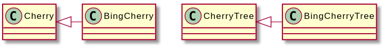

# Interesting and Obscure Inheritance Issues

* 참고문헌 : 전문가를 위한 C++(마크 그레고리 / 한빛미디어)

## 1. 오버라이드한 메서드의 속성 변경하기

### 1.1 리턴 타입 변경하기

베이스 클래스의 리턴 타입이 다른 클래스에 대한 포인터나 레퍼런스 타입이면 메서드를 오버라이드할 때 리턴 타입을 그 클래스의 파생 클래스에 대한 포인터나 레퍼런스 타입으로 바꿀 수 있다. 이런 타입을 공변 리턴 타입이라 부른다.

베이스 클래스와 파생 클래스가 병렬 계층을 이룰 때 이 기능이 유용할 수 있다.



위와 같은 Cherry-BingCherry와 CherryTree-BingCherryTree의 계층 두 개가 구성되어있다고 가정한다. 여기서 CherryTree 클래스에 체리 하나를 따는 pick()이란 가상 메서드를 정의한다.

```cpp
Cherry* CherryTree::pick()
{
    return new Cherry();
}
```

파생 클래스인 BingCherryTree에서 이 메서드를 오버라이드한다.

```cpp
Cherry* BingCherryTree::pick()
{
    auto theCherry = std::make_unique<BingCherry>();
    theCherry->polish();
    return theCherry.release();
}
```

BeingCherry를 딸 때 깨끗이 닦는 동작을 추가한 것이다. BingCherry도 일종의 Cherry이기 때문에 메서드 프로토타입은 그대로 유지하고 메서드의 구현 코드만 수정한다.

여기서 BeingCherry 포인터는 Cherry 포인터로 자동으로 캐스팅된다.

그런데 이 코드는 항상 BingCherry 객체를 리턴하기 때문에, 다음과 같이 리턴 타입을 변경할 수 있다.

```cpp
BingCherry* BingCherryTree::pick()
{
    auto theCherry = std::make_unique<BingCherry>();
    theCherry->polish();
    return theCherry.release();
}
```

이렇게 구현하면 다음과 같이 호출할 수 있다.

```cpp
BingCherryTree theTree;
std::unique_ptr<Cherry> theCherry(theTree.pick());
theCherry->pinrtType();
```

모든 코드에서 pick() 메서드가 항상 Cherry*를 리턴한다고 가정한 코드는 모두 문제 없이 컴파일되고 실행된다. 따라서 BingCherry도 일종의 Cherry이기 때문에 CherrTree 버전의 pick()이 리턴한 값에 대해 호출할 수 있는 메서드는 모두 BingCherryTree 버전의 pick()이 리턴한 값에 대해서도 호출할 수 있다.

하지만 리턴 타입을 void*와 같이 전혀 관련 없는 타입으로 변경할 수 없다.

또한 리턴 타입을 일반 포인터가 아닌 스마트 포인터를 사용하면 안된다. 그 이유는 스마트 포인터가 클래스 템플릿이기 때문이다. 

예를 들어 CherryTree::pick() 메서드가 다음과 같이 작성되었다고 하자.

```cpp
std::unique_ptr<Cherry> CherryTree::pick()
{
    return std::make_unique<Cherry>();
}
```

그러면 BingCherryTree::pikc() 메서드의 리턴 타입을 unique 포인터로 변경할 수 없다.

```cpp
class BingCherryTree : public CherryTree
{
    public:
        virtual std::unique_ptr<BingCherry> pick() override;
}
```

### 1.2 메서드 매개변수 변경하기

파생 클래스를 정의하는 코드에서 virtual 메서드를 선언할 때 이름은 부모 클래스에 있는 것과 동일하게 쓰고 매개변수만 다르게 지정하면 오버라이드 되지 않고 새로운 메서드가 정의된다.

```cpp
class Base
{
    public:
        virtual void someMethod();
};

class Derived : public Base
{
    public:
        virtual void someMethod(int i);
};
```

이렇게 정의하면 컴파일 에러는 발생하지 않지만 someMethod()가 오버라이드되지 않고, Derived 클래스에만 존재하는 새 메서드가 생성된다.

Derived 클래스에서 메서드를 이렇게 정의하면 부모 클래스에 있던 메서드를 가린다. 따라서 다음과 같이 작성하면 컴파일 에러가 발생한다.

```cpp
Derived myDerived;
myDerived.someMethod();
```

> Base에 있는 someMethod()를 오버라이드하려 했다면 메서드를 작성할 때 override란 키워드를 붙여야 오버라이드하는 코드에 잘못된 부분이 있으면 컴파일러가 에러 메시지를 출력해준다.

파생 클래스에서 프로토타입이 달라져도 부모 클래스 버전을 상속을 하기 위해서 다음과 같이 파생 클래스에서 부모 클래스의 메서드를 정의하고 using 키워드를 지정하는 것이다.

```cpp
class Base
{
    public:
        virtual void someMethod();
};

class Derived : public Base
{
    public:
        using Base::someMethod; // Base 버전을 명시적으로 상속
        virtual void someMethod(int i); // 새 버전을 추가
};
```

> 파생 클래스에서 베이스 클래스와 이름은 같고 매개변수는 다른 메서드를 만들 이유는 별로 없다.

## 2. 생성자 상속

```cpp
class Base
{
    public:
        virtual ~Base() = default;
        Base() = default;
        Base(std::string_view str);
};

class Derived : public Base
{
    public:
        Derived(int i);
};
```

위 예제 코드에서 Base의 디폴트 생성자나 string_view 매개변수를 받는 생성자로 Base 객체를 만들 수 있다.

반면 Derived 객체는 int 타입 인수를 받는 생성자로만 만들 수 있으며, Base 클래스에 정의된 string_view 인수를 받는 생성자로는 Derived 객체를 만들 수 없다.

```cpp
Base base("Hello");         // string_view 인수를 받는 Base 생성자 호출
Derived derived1(1);        // int 인수를 받는 Derived 생성자 호출
Derived derived2("Hello");  // 에러 발생
```

string_view 인수를 받는 Base 생성자로 Derived 객체를 만들고 싶다면 Derived 클래스에서 Base 생성자를 명시적으로 상속해야 한다.

```cpp
class Derived : public Base
{
    public:
        using Base::Base;
        Derived(int i);
};
```

using 키워드를 지정하면 부모 클래스의 디폴트 생성자를 제외한 모든 생성자를 상속한다.

```cpp
Derived derived1(1);        // int 인수를 받는 Derived 생성자 호출
Derived derived2("Hello");  // string_view 인수를 받는 Base 생성자 호출
```

또한 Derived 클래스는 Base에서 상속한 생성자 중에서 매개변수 리스트가 똑같은 생성자를 정의할 수 있다.

```cpp
class Base
{
    public:
        virtual ~Base() = default;
        Base() = default;
        Base(std::string_view str);
        Base(float f);
};

class Derived : public Base
{
    public:
        using Base::Base;
        Derived(float f); // float 버전 Base 생성자를 오버라이드
};
```

> using 구문으로 베이스 클래스의 생성자를 상속하면 디폴트 생성자를 제외한 모든 생성자를 한꺼번에 상속하기 때문에 베이스 클래스의 생성자 중 일부만 상속할 수는 없다. 또한 다중 상속할 때 여러 베이스 클래스에서 매개변수 목록이 똑같은 생성자는 상속할 수 없다. 어느 베이스 클래스에 있는 것을 호출할지 알 수 없기 때문이다. 이런 모호함을 해결하려면 파생 클래스에서 충돌하는 생성자를 명시적으로 정의해야 한다.

## 3. 메서드 오버라이딩의 특수한 경우

### 3.1 베이스 클래스가 static인 경우

C++에서는 static 메서드를 오버라이드할 수 없다.

메서드에 static과 virtual을 동시에 지정할 수 없다. static 메서드를 오버라이드하면 파생 클래스에 있는 static 메서드의 이름이 베이스 클래스의 static 메서드와 같으면 서로 다른 메서드 두 개가 생성된다.

```cpp
class BaseStatic
{
    public:
        static void beStatic() {
            cout << "BaseStatic being static." << endl;
        }
};

class DerivedStatic : public BaseStatic
{
    public:
        static void beStatic() {
            cout << "DerivedStatic keepin' it static." << endl;
        }
};
```

static 메서드는 클래스에 속하기 때문에 이름이 같더라도 각자 클래스에 있는 메서드 코드가 호출된다.

```cpp
BaseStatic::beStatic(); // BaseStatic being static.
DerivedStatic::beStatic(); // DerivedStatic keepin' it static.
```

이렇게 클래스 이름을 명시하면 문제가 없으나 이 메서드를 객체를 통해 호출할 때는 헷갈리기 쉽다. static 메서드를 객체 이름으로 호출하는 것을 허용하지만 static이기 때문에 this 포인터도 없고 객체에 접근할 수도 없다. 그래서 객체 이름으로 호출하더라도 실질적으로 클래스 이름으로 호출하는 문장과 같다.

다음과 같이 호출하면 기대와 다른 결과가 나온다.

```cpp
DerivedStatic myDerivedStatic;
BaseStatic& ref = myDerivedStatic;
myDerivedStatic.beStatic(); // DerivedStatic keepin' it static.
ref.beStatic(); // BaseStatic being static.
```

ref의 변수 타입은 BaseStatic 레퍼런스지만 이 변수가 실제로 가리키는 대상은 DerivedStatic 객체이지만 BaseStatic에 있는 beStatic()이 호출된다. C++은 static 메서드를 호출할 때 속한 객체를 찾지 않고, 컴파일 시간에 지정된 타입만 보고 호출할 메서드를 결정하기 때문이다.

### 3.2 베이스 클래스 메서드가 오버로드된 경우

베이스 클래스에 다양한 버전으로 오버로드된 메서드가 여러 개 있는데 그 중 한 버전만 오버라이드하면 컴파일러는 베이스 클래스에 있는 다른 버전의 메서드도 함께 가려버린다. 

```cpp
class Base
{
    public:
        virtual ~Base() = defatul;
        virtual void overload() {
            cout << "Base's overload()" << endl;
        }
        virtual void overload(int i) {
            cout << "Base's overload(int i)" << endl;
        }
};

class Derived : public Base
{
    public:
        virtual void overload() override {
            cout << "Derived's overload()" << endl;
        }
};
```

Derived 객체로 int 버전의 overload() 메서드를 호출하면 컴파일 에러가 발생한다.

```cpp
Derived myDerived;
myDerived.overload(2); // 에러 발생
```

Derived 객체에서 이 버전의 메서드를 접근하기 위해서 Derived 객체를 가리킬 변수를 Base 포인터나 Base 레퍼런스로 만들면 된다.

```cpp
Derived myDerived;
Base& ref = myDerived;
ref.overload(2);
```

파생 클래스에서 부모 클래스에 있는 나머지 오버로드된 메서드를 명시적으로 오버로드하면 오버라이드 한 메서드 이외에 부모 클래스의 오버로드된 메서드를 사용할 수 있다.

```cpp
class Base
{
    public:
        virtual ~Base() = defatul;
        virtual void overload() {
            cout << "Base's overload()" << endl;
        }
        virtual void overload(int i) {
            cout << "Base's overload(int i)" << endl;
        }
};

class Derived : public Base
{
    public:
        using Base::overload;
        virtual void overload() override {
            cout << "Derived's overload()" << endl;
        }
};
```

### 3.3 private나 protected로 선언된 베이스 클래스 메서드

private나 protected 메서드도 오버라이드할 수 있다. 메서드에 대한 접근 지정자는 그 메서드를 호출할 수 있는 대상만 제한할 뿐이다.

### 3.4 베이스 클래스 메서드에 디폴트 인수가 지정된 경우

파생 클래스와 베이스 클래스에서 지정한 디폴트 인수가 서로 다를 수 있다. 그런데 실행할 때 적용할 인수는 실제 내부에 있는 객체가 아닌 변수에 선언된 타입에 따라 결정된다.

```cpp
class Base
{
    public:
        virtual ~Base() = default;
        virtual void go(int i = 2){
            cout << "Base's go with i=" << i << endl;
        }
};

class Derived : public Base
{
    public:
        virtual void go(int i = 7) override {
            cout << "Derived's go with i=" << i << endl;
        }
};
```

이 경우 Derived 객체를 가리키지만 Base 타입이나 Base 레퍼런스로 선언된 변수로 go()를 호출하면 Derived 버전의 go() 코드가 실행되지만 디폴트 인수는 Base에 지정된 2가 적용된다.

```cpp
Base myBase;
Derived myDerived;

Base& myBaseReferenceToDerived = myDerived;
myBase.go();                    // Base's go with i=2
myDerived.go();                 // Derived's go with i=7
myBaseReferenceToDerived.go();  // Derived's go with i=2
```

### 3.5 베이스 클래스 메서드와 접근 범위를 다르게 지정하는 경우

메서드를 오버라이드할 때 접근 권한을 넓히거나 좁힐 수 있다.

메서드나 데이터 멤버에 대한 접근 권한을 좀 더 제한하는 방법은 두 가지가 있다. 하나는 베이스 클래스 전체에 대한 접근 지정자를 변경하는 것이다. 다른 방법은 다음 예시처럼 파생 클래스에서 접근자를 다르게 지정하는 것이다.

```cpp
class Gregarious
{
    public:
        virtual void talk() {
            cout << "Gregarious says hi!" << endl;
        }
};

class Shy : public Gregarious
{
    protected:
        virtual void talk() override {
            cout << "Shy reluctantly says hello." << endl;
        }
};
```

외부에서 Shy 객체의 talk()를 호출하면 컴파일 에러가 발생한다.

```cpp
Shy myShy;
myShy.talk(); // 컴파일 에러
```

하지만 Gregarious 타입의 레퍼런스나 포인터를 이용하면 이 메서드에 접근이 가능하다.

```cpp
Shy myShy;
Gregarious& ref = myShy;
ref.talk(); // Shy reluctantly says hello.
```

이처럼 파생 클래스에서 메서드를 오버라이드하는 데는 문제 없지만 베이스 클래스에서 public으로 선언한 메서드를 protected로 접근 범위를 제한하는 것은 완벽하게 적용되지 않는다.

> 베이스 클래스에서 public으로 선언한 메서드의 접근 범위는 완벽히 좁힐 수 없고, 굳이 좁힐 일ㄷ 거의 없다.

파생 클래스에서 접근 범위를 넓히는 가장 간단한 방법은 파생 클래스에 베이스 클래스의 protected 메서드를 호출하는 public 메서드를 정의하는 것이다.

```cpp
class Secret
{
    protected:
        virtual void dontTell() {
            cout << "I'll never tell." << endl;
        }
};

class Blabber : public Secret
{
    publi:
        virtual void tell() { dontTell(); }
};
```

Blabber 객체의 public tell() 메서드를 호출하는 클라이언트는 실제로 Secret 클래스의 protected 메서드에 접근하는 경로를 제공받는다.

또 다른 방법은 Blabber에서 dontTell() 메서드를 오버라이드하면서 접근 범위를 public으로 변경하는 것이다.

```cpp
class Blabber : public Secret
{
    public:
        virtual void dontTell() override {
            cout << "I'll tell all!" << endl;
        }
};
```

만약 오버라이드한 메서드의 구현 코드는 그대로 두고 접근 범위만 변경하고 싶다면 using 문을 사용한다.

```cpp
class Blabber : public Secret
{
    public:
        using Secret::dontTell;
};
```

베이스 클래스 메서드의 접근 범위는 여전히 protected이므로 Secret 타입의 포인터나 레퍼런스로 Secret 버전의 dontTell() 메서드를 외부에서 호출하면 컴파일 에러가 발생한다.

```cpp
Blabber myBlabber;
Secret& ref = myBlabber;
Secret* ptr = &myBlabber;
ref.dontTell(); // 컴파일 에러
ptr->dontTell(); // 컴파일 에러
```

> 접근 범위 변경 사례 중 현실적으로 유용한 것은 protected 메서드의 접근 범위를 넓히는 경우임을 보여준다.