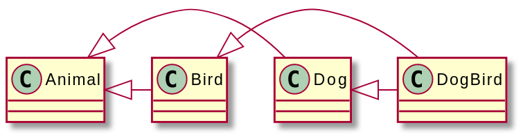

# Interesting and Obscure Inheritance Issues 2

* 참고문헌 : 전문가를 위한 C++(마크 그레고리 / 한빛미디어)

## 4. 파생 클래스의 복제 생성자와 대입 연산자

복제 생성자와 대입 연산자를 파생 클래스에서 정의할 때 몇 가지 주의점이 있다.

파생 클래스에 포인터와 같은 특수한 데이터가 있어서 디폴트가 아닌 복제 생성자나 대입 연산자를 정의해야 할 경우가 아니라면 베이스 클래스에 복제 생성자나 대입 연산자가 있더라도 파생 클래스에서 다시 정의할 필요가 없다.

파생 클래스에서 복제 생성자나 대입 연산자를 정의하는 코드를 생략하면 파생 클래스의 데이터 멤버에 대한 디폴트 복제 생성자나 대입 연산자가 생성되고, 베이스 클래스의 데이터 멤버에 대해서는 베이스 클래스의 복제 생성자나 대입 연산자가 적용된다.

반면 파생 클래스에서 복제 생성자를 명시적으로 정의하면 반드시 부모 클래스의 복제 생성자를 호출해야 한다. 그렇지 않으면 객체에서 부모 부분에 대해 복제 생성자가 아닌 디폴트 생성자가 사용된다.

```cpp
class Base
{
    public:
        virtual ~Base() = default;
        Base() = default;
        Base(const Base& src);
};

Base::Base(const Base& src)
{
}

class Derived : public Base
{
    public:
        Derived() = default;
        Derived(const Derived& src);
};

Derived::Derived(const Derived& src) : Base(src)
{
}
```

파생 클래스에서 대입 연산자를 오버라이드하면 객체의 일부분만 대입 연산을 적용할 때와 같은 경우를 제외한다면 베이스 클래스 버전의 대입 연산자도 함께 호출해야 한다.

```cpp
Derived& Derived::operator=(const Derived& rhs)
{
    if(&rhs == this) {
        return *this;
    }
    Base::operator=(rhs); // 부모의 대입 연산자 호출

    // 파생 클래스의 대입 연산 수행(코드 생략)

    return *this;
}
```

> 파생 클래스에서 복제 생성자나 대입 연산자를 지정하지 않으면 베이스 클래스의 기능이 그대로 적용된다. 하지만 파생 클래스에서 복제 생성자나 대입 연산자를 별도로 정의했다면 베이스 클래스에 있는 것을 명시적으로 호출해야 사용할 수 있다.

## 5. 실행 시간 타입 정보

실행 시간 타입 정보(RTTI, Run-Time Type Information)는 객체가 속한 클래스 정보를 다루는 데 필요한 기능을 다양하게 제공한다.

대표적인 예로 dynamic_cast()가 있다. 객체지향 계층 사이에서 타입을 안전하게 변환해준다. vtable이 없는 클래스에 대해 dynamic_cast()를 호출하면 컴파일 에러가 발생한다.

또 다른 기능으로 typeid 연산자가 있다. 이 연산자를 이용하면 실행 시간에 객체의 타입 정보를 조회할 수 있다. typeid를 사용할 일은 거의 없다. 객체의 타입에 따라 다르게 실행되는 코드는 virtual 메서드로 구현하는 것이 바람직하기 때문이다.

typeid 연산자는 다음과 같이 주로 로깅 및 디버깅 용도로 활용한다.

```cpp
class Loggable
{
    public:
        virtual ~Loggable() = default;
        virtual std::string getLogMessage() const = 0;
};

class Foo : public Loggable
{
    public:
        std::string getLogMessage() const override;
};

std::string Foo::getLogMessage() const
{
    return "Hello logger.";
}

void logObject(const Loggable& loggableObject)
{
    cout << typeid(loggableObject).name() << ": ";
    cout << loggableObject.getLogMessage() << endl;
}
```

## 6. non-public 클래스 상속

부모 클래스를 선언할 때 public 키워드 뿐만 아니라 private, protected로 지정을 할 수는 있으나, 흔하게 사용되지는 않다.

> 부모 클래스에 접근 지정자를 붙이지 않으면 상속할 때 class에 대해서는 private가, struct에 대해서는 public이 적용된다.

부모 클래스를 protected로 지정하면 베이스 클래스에 있던 public 메서드와 데이터 멤버가 파생 클래스에서 모두 protected로 취급된다. 마찬가지로 private로 지정하면 베이스 클래스의 public 및 protected 메서드와 데이터 멤버가 파생 클래스에서 모두 private로 취급된다.

## 7. 가상 베이스 클래스

다중 상속 시 동일한 클래스를 상속하는 부모 클래스를 여러개 상속할 경우 모호함이 발생한다. 하지만 중복되는 부모가 가상 베이스 클래스라면 모호한 상황을 해결할 수 있다.

다음 코드는 Animal 베이스 클래스에 sleep() 메서드를 추가하고, Dog와 Bird 클래스에서 Animal을 가상 베이스 클래스로 상속하도록 수정하였다. 이 과정에서 만약 Animal 클래스 앞에 virtual 키워드를 지정하지 않으면 DogBird 객체로 sleep()을 호출할 때 모호함이 발생해서 컴파일 에러가 발생한다. DogBird 입장에서 Animal의 하위 타입이 두 개나 있기 때문이다. 하지만 Animal을 가상으로 상속하면 Animal 하위 타입이 하나만 생성되기 때문에 sleep()을 호출할 때 모호한 상황이 발생하지 않는다.



```cpp
class Animal
{
    public:
        virtual void eat() = 0;
        virtual void sleep() { cout << "zzzzz..." << endl; }
};

class Dog : public virtual Animal
{
    public:
        virtual void bark() { cout << "Woof!" << endl; }
        virtual void eat() { cout << "The dog ate." << endl; }
};

class Bird : public virtual Animal
{
    public:
        virtual void chirp() { cout << "Chirp!" << endl; }
        virtual void eat() { cout << "The bird ate." << endl; }
};

class DogBird : public Dog, public Bird
{
    public:
        virtual void eat() override { Dog::eat(); }
};

int main()
{
    DogBird myConfusedAnimal;
    myConfusedAnimal.sleep(); // 베이스를 virtual로 선언해서 모호함이 발생하지 않음
    return 0;
}
```

> 클래스 계층의 모호함을 방지하기 위한 좋은 방법은 가상 베이스 클래스를 사용하는 것이다.