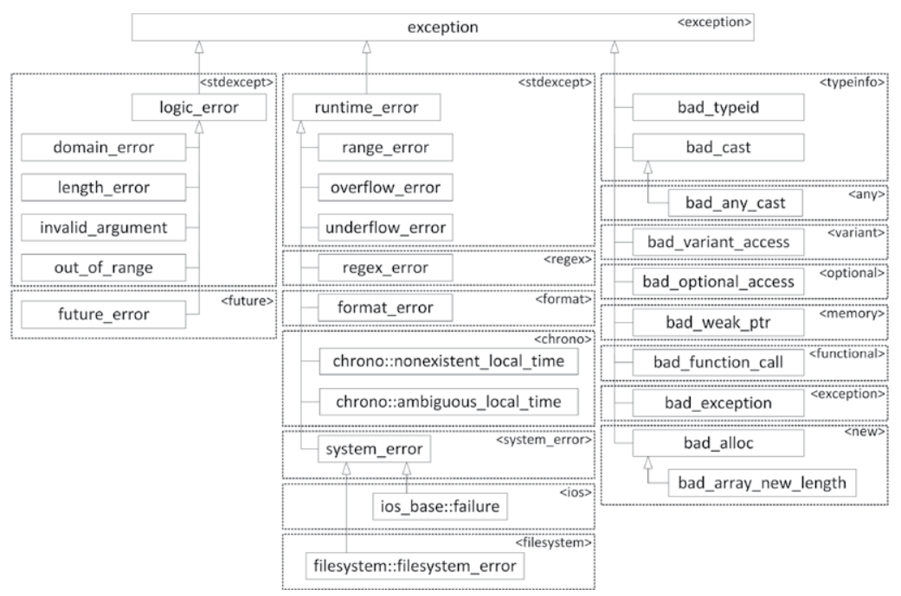

# Exceptions and Polymorphism

* 참고문헌 : 전문가를 위한 C++(마크 그레고리 / 한빛미디어)

## 1. 표준 익셉션 클래스의 계층 구조

익셉션 타입을 클래스로 정의하면 계층 구조를 형성할 수 있기 때문에 익셉션을 처리하는 코드에서 다형성을 활용할 수 있다.



*이미지 참조: https://junstar92.tistory.com/338*

C++ 표준 라이브러리에서 던지는 익셉션 객체의 클래스는 모두 이 계층 구조에 속한다. 여기 나온 클래스는 모두 `what()` 메서드를 가지고 있다. 이 메서드는 익셉션을 표현하는 `const char*` 타입의 스트링을 리턴하며, 에러 메시지 출력에 활용할 수 있다.

익셉션 클래스는 대부분 `what()` 메서드가 리턴할 스트링을 생성자의 인수로 지정해야 한다. 베이스 클래스인 `exception`은 반드시 생성자에 이 값을 전달해야 한다.

다음 예제는 `readIntegerFile()`에서 에러 메시지를 만들 때 파일 이름도 함께 표시하도록 수정한다. 표준 사용자 정의 리터럴인 `'s'`를 이용하여 스트링 리터럴을 `std::string`으로 만든다.

```cpp
vector<int> readIntegerFile(string_view fileName)
{
    ifstream inputSream(fileName.data());
    if(inputStream.fail()){
        // 파일 열기에 실패한 경우: 익셉션을 던진다.
        const string error = "Unable to open file "s + fileName.data();
        throw invalid_argument(error);
    }

    // 정수를 하나씩 읽어서 벡터에 추가한다.
    vector<int> integers;
    int temp;
    while(inputStream >> temp){
        integers.push_back(temp);
    }

    if(!inputStream.eof()){
        // 파일 끝(EOF)에 도달하지 않았다.
        // 다시 말해 파일을 읽는 도중 에러가 발생했다.
        // 따라서 익셉션을 던진다.
        const string error = "Unable to read file "s + fileName.data();
        throw runtime_error(error);
    }
    return integers;
}

int main()
{
    // 이전 코드 생략
    try{
        myInts = readIntegerFile(fileName);
    }catch(const invalid_argument& e){
        cerr << e.what() << endl;
        return 1;
    }catch(const runtime_error& e){
        cerr << e.what() << endl;
        return 2;
    }
    // 나머지 코드 생략
}
```

## 2. 클래스 계층 구조에서 정확한 익셉션 타입 선택하기

익셉션 타입을 클래스 계층으로 구성하면 `catch` 구문에서 다형성을 활용할 수 있다. 예를 들어 위 예제는 `invalid_argument`와 `runtime_error`는 모두 `exception`을 상속하기 때문에 두 `catch` 문을 다음과 같이 `exception` 타입의 인수를 받는 하나의 `catch` 문으로 합칠 수 있다.

```cpp
try{
    myInts = readIntegerFile(fileName);
}catch(const exception& e){
    cerr << e.what() << endl;
    return 2;
}
```

단, 익셉션 계층에서 베이스로 올라갈수록 에러를 구체적으로 처리하기 힘들어진다. 일반적으로 `catch` 문에서 처리할 추상화 수준에 최대한 맞게 익셉션 타입을 지정하는 것이 바람직하다.

> `catch` 구문에 다형성을 적용하려면 반드시 인수를 레퍼런스 타입으로 받아야 한다. 값으로 받으면 슬라이싱이 발생해서 객체 정보가 손상될 수 있다.

다형성을 이용한 `catch` 구문이 여러 개라면 코드에 나온 순서대로(가장 먼저 매칭되는 구문으로) 결정된다. 앞에 나온 `catch` 문이 뒤에 나온 `catch` 문보다 추상적이라면(클래스 계층에서 위쪽에 있다면) 앞의 것을 먼저 선택한다. 따라서 구체적인 타입을 뒤에 적으면 한 번도 실행되지 않는다. 따라서 구체적인 타입의 `catch`문을 앞에 적어야 한다.

```cpp
try{
    myInts = readIntegerFile(fileName);
}catch(const invalid_argument& e){ // 파생 클래스를 먼저 적는다.
    // 파일 이름이 잘못된 경우를 처리한다.
}catch(const exception& e){ // exception 타입을 처리하는 코드를 그 뒤에 적는다.
    cerr << e.what() << endl;
    return 1;
}
```

## 3. 익셉션 클래스 직접 정의하기

익셉션 클래스를 직접 정의하면 다음 두 가지 장점이 있다.

1. C++ 표준 라이브러리는 익셉션을 몇 가지 종류만 제공한다. 따라서 직접 정의한 익셉션 클래스를 이용하여 에러에 최대한 가까운 이름으로 표현할 수 있다.
2. 원하는 정보를 익셉션에 얼마든지 추가할 수 있다. 표준 라이브러리에서 제공하는 익셉션은 에러 스트링만 넣을 수 있다.

익셉션을 직접 정의할 때는 반드시 표준 `exception` 클래스를 직접 또는 간접적으로 상속하는 것이 좋다. 그래야 프로그램에서 발생하는 익셉션이 모두 `exception`을 상속하게 만들 수 있다. 이렇게 하면 에러 처리 코드에서 다형성을 이용하기 훨씬 쉽다.

예를 들어 `invalid_argument`와 `runtime_error`는 `readIntegerFile()`에서 발생하는 파일 열기와 읽기 에러를 구체적으로 표현하지 못한다. 따라서 다음과 같이 구체적인 상황을 FileError 클래스로 표현하고, 이 클래스가 `exception`을 상속하도록 정의해서 파일 에러에 대한 클래스 계층을 구성하게 만들면 좋다.

```cpp
class FileError : public exception
{
    public:
        FileError(string_view fileName) : mFileName(fileName) {}
        virtual const char* what() const noexcept override {
            return mMessage.c_str();
        }

        string_view getFileName() const noexcept { return mFileName; }

    protected:
        void setMessage(string_view message) { mMessage = message; }
    
    private:
        string mFileName;
        string mMessage;
};
```

`exception`을 상속하려면 `what()` 메서드를 오버라이드해야 한다. 이 메서드는 `const char*` 타입의 스트링을 리턴한다. 이 스트링은 익셉션 객체가 소멸되기 전까지 사용할 수 있다. 이 스트링을 `FileError`의 `mMessage` 데이터 멤버 값으로 지정한다. `FileError`의 파생 클래스는 `protected setMessage()` 메서드를 이용하여 이 메시지를 다른 값으로 설정할 수 있다. 이때 `FileError` 클래스는 파일 이름을 담는 데이터 멤버와 이 값에 대한 `public` 접근자도 정의한다.

`readInetegerFile()`에서 발생할 수 있는 예외 상황으로 파일이 열리지 않는 경우가 있다. 이를 위해 다음과 같이 `FileError`를 상속하는 `FileOpenError` 익셉션을 정의한다. `FileOpenError` 익셉션은 파일 열기 에러를 표현하는 값을 `mMessage` 스트링에 지정한다.

```cpp
class FileOpenError : public FileError
{
    public:
        FileOpenError(string_view fileName) : FileError(fileName)
        {
            setMessage("Unable to open "s + fileName.data());
        }
};
```

`readIntegerFile()`을 실행할 때 파일을 읽을 수 없는 경우도 발생할 수 있다. 이럴 때는 `what()` 메서드가 에러가 발생한 파일 이름 뿐만 아니라 줄 번호도 함께 알려주면 좋을 것이다. 따라서 `FileError`를 상속하는 `FileReadError`를 다음과 같이 정의한다.

```cpp
class FileReadError : public FileError
{
    public:
        FileReadError(string_view fileName, size_t lineNumber)
            : FileError(fileName), mLineNumber(lineNumber)
        {
            ostringstream ostr;
            ostr << "Error reading " << fileName << " at line " << lineNumber;
            setMessage(ostr.str());
        }

        size_t getLineNumber() const except { return mLineNumber; }

    private:
        size_t mLineNumber;
}
```

줄 번호를 정확히 표시하려면 `readIntegerFile()` 함수에서 정수를 읽을 때 현재 줄 번호도 추적하도록 수정해야 한다. 새로 정의한 익셉션을 던지도록 코드를 수정하면 다음과 같다.

```cpp
vector<int> readIntegerFile(string_view fileNmae)
{
    ifstream inputStream(fileNmae.data());
    if(inputStream.fail()){
        // 파일 열기에 실패한 경우: 익셉션을 던진다.
        throw FileOpenError(fileName);
    }

    vector<int> integers;
    size_t lineNumber = 0;
    while(!inputStream.eof()){
        // 파일에서 한 줄을 읽는다.
        string line;
        getline(inputStrea, line);
        ++lineNumber;

        // 방금 읽은 한 줄에 대한 스트링 스트림을 생성한다.
        istringstream lineStream(line);

        // 파일에서 정수를 하나씩 읽어 벡터에 추가한다.
        int temp;
        while(lineStream >> temp) {
            integers.push_back(temp);
        }

        if(!lineStream.eof()){
            // 스트링 스트림의 끝에 도달하지 않았다.
            // 다시 말해 한 줄을 읽는 도중에 에러가 발생했다.
            // 따라서 익셉션을 던진다.
            throw FileReadError(fileName, lineNumber);
        }
    }

    return integers;
}
```

`readIntegerFile()`을 호출할 때 `FileError`의 다형성을 이용하여 익셉션을 처리하도록 `catch` 구문을 다음과 같이 작성할 수 있다.

```cpp
try{
    myInts = readIntegerFile(fileName);
}catch(const FileError& e){
    cerr << e.what() << endl;
    return 1;
}
```

> 익셉션을 레퍼런스로 받지 않고 값으로 받으면 복제가 여러번 발생할 수 있다. 따라서 익셉션 객체를 레퍼런스로 받으면 쓸데없는 복제 연산을 방지할 수 있다.

## 4. 중첩된 익셉션

앞서 발생한 익셉션을 처리하는 도중에 또 다른 에러가 발생해서 새로운 익셉션이 전달될 수 있다. 이렇게 중간에 익셉션이 발생하면 현재 처리하고 있던 익셉션 정보가 사라진다. 이를 해결하기 위해 C++에서는 먼저 잡은 익셉션을 새로 발생한 익셉션의 문맥 안에 포함시키는 중첩된 익셉션이라는 기능을 제공한다.

현재 구현하는 프로그램에서 `A 타입` 익셉션을 던지는 서드파티 라이브러리의 함수를 사용하는데, 현재 작성하는 프로그램에서는 `B 타입` 익셉션만 처리하게 만들고 싶을 수 있다. 이럴 때는 서드파티 라이브러리에서 발생하는 익셉션을 모두 `B 타입` 안에 중첩시키면 된다.

어떤 익셉션을 처리하는 `catch` 문에서 새로운 익셉션을 던지고 싶다면 `std::thorw_with_nested()`를 사용하면 된다. 나중에 발생한 익셉션을 처리하는 `catch` 문에서 먼저 발생했던 익셉션에 접근할 때는 `dynamic_cast()`를 이용하면 된다. 이때 먼저 발생한 익셉션은 `nested_exception`으로 표현한다.

다음과 같이 `exception`을 상속하고, 생성자에서 스트링을 인수로 받는 `MyException` 클래스를 정의한다.

```cpp
class MyException : public std::exception
{
    public:
        MyException(string_view message) : mMessage(message) {}
        virtual const char* what() const noexcept override {
            return mMessage.c_str();
        }
    private:
        string mMessage;
};
```

먼저 발생한 익셉션을 처리하다가 새로운 익셉션을 던져야 하는데 그 안에 앞서 발생한 익셉션을 담아서 던지려면 `std::throw_with_nested()` 함수를 호출해야 한다.

다음 코드는 `doSomething()` 함수에서 `runtime_error`를 던지는데 바로 다음에 나온 `catch` 핸들러가 이를 잡아서 처리한다. 이 핸들러는 몇 가지 메시지를 작성하고 나서 새로운 익셉션을 던지는데, 이때 `throw_with_nested()` 함수를 이용하여 새로운 익셉션 안에 먼저 발생한 익셉션을 담아서 던진다. 익셉션을 중첩시키는 작업은 자동으로 처리된다.

```cpp
void doSomething()
{
    try{
        throw runtime_error("Throwing a runtime_error exception");
    }catch(const runtime_error& e){
        cout << __func__ << " caught a runtime_error" << endl;
        cout << __func__ << " throwing MyException" << endl;
        throw_with_nested(
            MyException("MyException with nested runtime_error");
        )
    }
}
```

다음 `main()` 함수는 중첩된 익셉션을 처리하는 방법을 보여준다. 여기서는 `doSomethign()` 함수를 호출하는 코드가 있고, 그 아래에 `MyException` 익셉션을 처리하는 `catch` 핸들러가 나온다. 이 핸들러가 익셉션을 잡으면 메시지를 작성한 뒤 `dynamic_cast()`를 이용하여 현재 익셉션에 중첩된 익셉션에 접근한다. 그 안에 중첩된 익셉션이 없다면 널 포인터를 리턴한다. 중첩된 익셉션이 있다면 `nested_exception`의 `rethrow_nested()` 메서드를 호출해서 중첩된 익셉션을 다시 던진다. 그러면 다른 `try/catch` 구문에서 이 익셉션을 처리할 수 있다.

```cpp
int main()
{
    try{
        doSomething();
    }catch(const MyException& e){
        cout << __func__ << " caught MyException: " << e.what() << endl;
        const auto* pNested = dynamic_const<const nested_exception*>(&e);
        if(pNested){
            try{
                pNested->rethrow_nested();
            }catch(const runtime_error& e){
                // 중첩된 익셉션을 처리한다.
                cout << " Nested exception: " << e.what() << endl;
            }
        }
    }
    return 0;
}
```

이 코드를 실행한 결과는 다음과 같다.

```bash
doSomething caught a runtime_error
doSomething throwing MyException
main caught MyException: MyException with nested runtime_error
 Nested exception: Throwing a runtime_error exception
```

앞에 나온 `main()` 함수는 `dynamic_cast()`를 이용하여 중첩된 익셉션이 있는지 확인했다. 이렇게 중첩된 익셉션을 확인하기 위해 `dynamic_cast()`를 호출할 일이 많기 때문에 이 작업을 수행하는 `std::rethrow_if_nested()`란 간단한 헬퍼 함수를 표준에 정의해뒀다.

```cpp
int main()
{
    try{
        doSomething();
    }catch(const MyException& e){
        cout << __func__ << " caught MyException: " << e.what() << endl;
        try{
            rethrow_if_nested(e);
        }catch(const runtime_error& e){
            // 중첩된 익셉션을 처리한다.
            cout << " Nested exception: " << e.what() << endl;
        }
    }
    return 0;
}
```