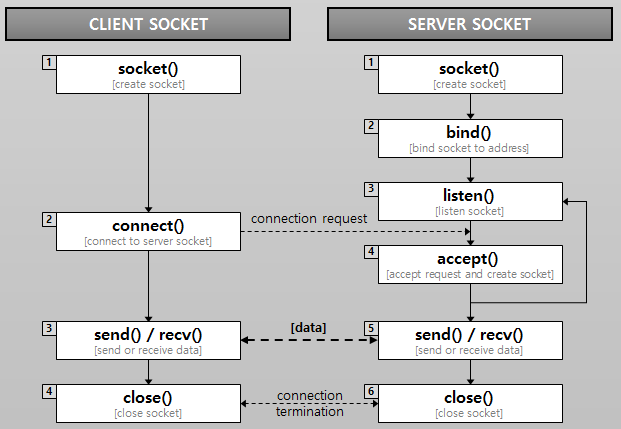

# TCP/IP

## 참고 문헌

*- [파이썬: TCP/IP 소켓 통신](https://duri1994.github.io/python/python-socket-network/)*

*- [소켓 프로그래밍_개념 및 절차](https://aronglife.tistory.com/entry/NetworkTCPIP-%EC%86%8C%EC%BC%93-%ED%94%84%EB%A1%9C%EA%B7%B8%EB%9E%98%EB%B0%8D-%EA%B0%9C%EB%85%901?category=910808)*

##### 네트워크 계층
1) 응용 계층: 데이터를 받아서 어플리케이션에서 사용. 포트번호(네트워크 앱을 구분하는 고유한 번호)
2) 전송계층(TCP/UDP): 데이터를 목적지에 전달하기 위해 길을 수립(라우팅). 패킷을 전달, 패킷 수신, 오류 체크
3) ip 계층(IP/ARP/RARP): 전송할 데이터를 패킷 단위로 단편화. 패킷에 목적지, 보내는 주소를 논리주소로 설정. 주소 변환(논리주소 <-> 맥주소)
4) 물리계층: 랜선으로 직접 물려있는 통신. 맥주소로 로컬 통신

##### 소켓 통신종류
1. TCP(전송 제어 프로토콜)
    * 한번 수립한 루트를 연결이 끊어질 때까지 계속 사용함 -> 신뢰성이 높은편, 연결지향적
    * 상대방이 패킷을 받았는지 확인, 순서, 오류 등을 체크 -> 속도는 느림

2. UDP(사용자 데이터그램 프로토콜)
    * 신뢰성이 떨어짐, 비연결지향적
    * 패킷 전달할 때 마다 새 길을 수립하고 순서, 오류 체크 안함 -> 속도는 빠름
    * 전사적으로 메세지 전달하는 작업이나 브로드캐스팅에 적합함

##### 소켓 통신
소켓(Socket)이란 프로세스들로 하여금 네트워크를 통해 서로 통신을 할 수 있도록 하는 ‘창구’의 역할을 하는 것을 의미한다. 각 프로세스들은 다른 프로세스와 데이터를 주고 받기 위해선 반드시 소켓을 열고, 다른 프로세스의 소켓과 연결하여야 한다. 이러한 소켓을 이용한 네트워크 통신을 소켓 통신이라고 한다.

1. socket() : 지정한 프로토콜과 전송방식을 갖는 소켓을 생성한다. (파일 디스크립터 반환)
2. *bind() : 지정한 프로토콜을 갖는 소켓에 주소(IP, Port)를 할당한다. (조금 어려움..)
3. listen() : 지정한 디스크립터 소켓을 서버소켓으로하여 연결요청을 '대기상태'에 둔다.
3-1. connect() : 클라이언트의 디스크립터 소켓을 전달해 연결요청을 한다.
4. accept() : 대기상태에 있는 클라이언트의 요청을 순서대로 수락한다. (비로소 데이터 주고받을 수 있음)
5. send(), recv(), close() : 데이터 주고받고 끝낸다.