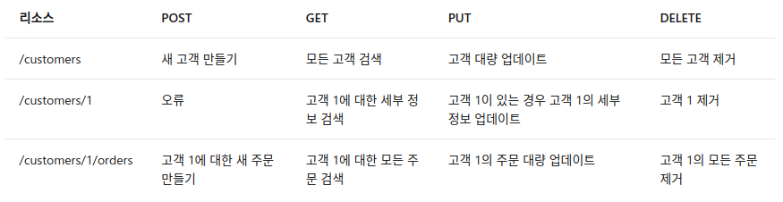

# REST API

## 0. 참고 문헌
*- [Microsoft RESTful web API Design](https://docs.microsoft.com/ko-kr/azure/architecture/best-practices/api-design)*

*- [https://gmlwjd9405.github.io/2018/09/21/rest-and-restful.html](https://gmlwjd9405.github.io/2018/09/21/rest-and-restful.html)*

*- [https://hoyeonkim795.github.io/posts/rest_api/](https://hoyeonkim795.github.io/posts/rest_api/)*

## 1. REST란?

Roy Fielding이 2000년도에 웹 서비스를 디자인하는 아키텍처 접근 방식으로 REST(Representational State Transfer)를 제안하였다. REST는 WWW(World Wide Web)와 같은 하이퍼미디어 기반 분산 시스템을 구축하기 위한 아키텍처 스타일이다. REST는 어떤 기본 프로토콜과도 독립적이며 HTTP에 연결될 필요가 없으나, 가장 일반적인 REST API 구현은 응용 프로그램 프로토콜로 HTTP를 사용한다.

다음은 HTTP를 이용한 REST API 디자인의 원칙이다.
* REST API는 리소스(resource)를 중심으로 디자인되며, 클라이언트(client)에서 액세스할 수 있는 모든 종류의 개체(object), 데이터(data) 또는 서비스(service)가 리소스에 포함된다.
* 리소스마다 해당 리소스를 고유하게 식별하는 URI인 식별자가 있다. 예를 들어 특정 고객 주문의 URI는 다음과 같다.
```http
https://adventure-works.com/orders/1
```
* 클라이언트가 리소스의 표현(representation of resource)을 이용하여 서비스와 정보를 주고받는다. Web API가 교환 형식으로 XML 형식과 JSON 형식을 사용하며, 대부분의 경우 JSON 형식을 사용한다. 예를 들어 위에 나열된 URI에 대한 GET 요청은 이 응답(response)을 리턴한다.
```json
{"orderId":1,"orderValue":99.90,"productId":1,"quantity":1}
```
* REST API는 균일한 형태의 인터페이스를 사용하므로 클라이언트와 서비스 구현을 분리하는 데 도움이 된다. HTTP를 기반으로 하는 REST API는 표준 HTTP 동사(standard HTTP verbs = HTTP Method)를 사용하여 리소스에 대한 기능 수행을 한다. 가장 일반적인 기능은 GET, POST, PUT, PATCH 및 DELETE이다.

## 2. REST 기본 개념
## 2.1 Method
대부분의 RESTful 웹 API에서 사용하는 일반적인 HTTP 메서드는 대표적으로 4가지가 있다.

* GET : GET을 통해 해당 리소스를 조회한다. 리소스를 조회하고 해당 도큐먼트에 대한 자세한 정보를 가져온다.
* POST : POST를 통해 지정된 URI에 새 리소스를 생성하며, 요청 메시지는 새 리소스의 세부 정보를 제공한다. 참고로 POST를 사용하여 실제로 리소스를 만들지 않는 작업을 트리거할 수도 있다.
* PUT : 지정된 URI에 리소스를 만들거나 대체/수정하며, 요청 메시지는 만들거나 업데이트할 리소스를 지정한다.
* DELETE : 지정된 URI의 리소스를 제거한다.

다음 표는 전자 상거래 예제를 사용하여 대부분의 RESTful 구현에서 채택하는 일반적인 규칙을 요약한 표이다.


GET과 POST를 비교하면,
1. GET은 데이터를 요청할 때 HTTP Request Message의 Header 부분에 url이 담겨서 전송된다. 이러한 방식은 url에 데이터가 담기기 때문에 보낼 수 잇는 데이터 크기가 한정적이며 보안성이 떨어진다.
2. POST는 body 부분에 데이터를 담아 전송하기 때문에, 데이터의 크기, 보안성 부분에서 더 뛰어나다.

## 2.2 Resource
리소스는 uri를 뜻하며, uri는 인터넷 상의 자원을 식별하기 위한 문자열의 구성이다. 이 리소스를 통해 메소드를 수행하고, 작업을 실행하게 된다.

## 2.3 Representation of Resoure

Client가 자원의 상태(정보)에 대한 조작을 요청하면 Server는 이에 적절한 응답(Representation)을 보낸다. 이때, REST에서 하나의 자원은 JSON, XML, TEXT, RSS 등 여러 형태의 Representation으로 나타내어 질 수 있다. 일반적으로는 JSON 혹은 XML를 통해 데이터를 주고 받는다.

## 3. REST의 특징

### 3.1 Server-Client 구조
리소스를 가지고 있는 쪽이 Server이며, 리소스를 요청하는 쪽이 Client가 된다. Server는 API를 제공하고, 비즈니스 로직의 처리 및 저장을 책임진다. Client는 사용자 인증이나 context 등을 직접 관리하고 책임진다.

### 3.2 Stateless
HTTP 프로토콜은 Stateless 프로토콜이므로, REST 역시 무상태성을 지닌다. 이는 Client의 context를 Server에 저장하지 않으며, Server는 Client의 요청을 개별의 것으로 인식하고 처리함을 나타낸다. 이는 Server의 처리 방식에 일관성을 부여하고, 부담이 줄어들어 자유도를 높인다.

### 3.3 Cacheable
웹 표준 HTTP 프로토콜을 사용하므로 웹에서 사용하는 기존의 인프라를 그대로 활용할 수 있다. 즉, HTTP가 가진 강력한 특징 인 캐싱 기능을 적용할 수 있으며, 이는 전체 응답시간, 성능, 서버의 자원 이용률 등을 향상시킬 수 있다. HTTP 프로토콜 표준에서 사용하는 Last-Modified 태그나 E-Tag를 이용하면 캐싱 구현이 가능하다.

### 3.4 Layered System
Client는 REST API Server만 호출하며, REST API Server는 다중 계층으로 구성될 수 있다. REST API Server는 순수 비즈니스 로직을 수행하고, 그 앞 단에 보안, 로드밸런싱, 암호화, 사용자 인증 등을 추가하여 구조상의 유연성을 줄 수 있다.

### 3.5 Code-On-Demand
Server로부터 스크립트를 받아서 Client에서 실행하며, 반드시 충족할 필요는 없다.

### 3.6 Uniform Interface
URI로 지정한 리소스에 대한 조작을 통일되고 한정적인 인터페이스로 수행하며, HTTP 프로토콜에 따르는 모든 플랫폼에서 사용 가능하며, 특정 언어나 기술에 종속되지 않는다.

## 4. REST API란
REST 기반으로 서비스 API(Application Programming Interface)를 구현한 것으로, REST를 기반으로 시스템을 분산하여 확장성과 재사용성을 높이고, HTTP 표준을 기반으로 구현되어 HTTP를 지원하는 프로그램 언어로 클라이언트, 서버를 구현할 수 있다.

## 5. REST API 설계 기본 규칙

* URI는 정보의 자원을 표현해야 한다.
  * 리소스는 동사보다는 명사를, 대문자보다는 소문자를 사용
  * 리소스의 도큐먼트(객체 인스턴스나 데이터베이스 레코드와 유사한 개념) 이름으로는 단수 명사를 사용
  * 리소스의 컬렉션(서버에서 관리하는 디렉터리라는 리소스) 이름으로는 복수 명사를 사용
  * 리소스의 스토어(클라이언트에서 관리하는 리소스 저장소) 이름으로는 복수 명사를 사용

* 리소스에 대한 행위는 HTTP Method(GET, PUT, POST, DELETE 등)으로 표현한다.
  * URI에 HTTP Method가 들어가면 안된다.
  * URI에 행위에 대한 동사 표현이 들어가면 안된다.
  * 경로 부분 중 변하는 부분은 유일한 값으로 대체한다.(예를 들어, ID는 특정 리소스를 나타내는 고유값이다.)

## 6. REST API 설계 규칙
* 슬래시 구분자(/)는 계층 관계를 나타내는데 사용된다.
* URI 마지막 문자로 슬래시(/)를 포함하지 않는다.
  * URI에 포함되는 모든 글자는 리소스의 유일한 식별자로 사용되어야 하며 URI가 다르다는 것은 리소스가 다르다는 것이고, 역으로 리소스가 다르면 URI도 달라져야 한다.
  * REST API는 분명한 URI를 만들어 통신을 해야 하기 때문에 혼동을 주지 않도록 URI 경로의 마지막에는 슬래시(/)를 사용하지 않는다.
* 하이픈(-)은 URI 가독성을 높이는데 사용된다.
  * 불가피하게 긴 URI경로를 사용하게 된다면 하이픈을 사용해 가독성을 높인다.
* 밑줄(_)은 URI에 사용하지 않는다.
  * 밑줄은 보기 어렵거나 밑줄 때문에 문자가 가려지기도 하므로 가독성을 위해 밑줄은 사용하지 않는다.
* URI 경로에는 소문자가 적합하다.
  * URI 경로에 대문자 사용은 피하도록 한다.
  * RFC 3986(URI 문법 형식)은 URI 스키마와 호스트를 제외하고는 대소문자를 구별하도록 규정하기 때문
* 파일확장자는 URI에 포함하지 않는다.
  * REST API에서는 메시지 바디 내용의 포맷을 나타내기 위한 파일 확장자를 URI 안에 포함시키지 않는다.
  * Accept header를 사용한다.
* 리소스 간에는 연관 관계가 있는 경우 `/리소스명/리소스 ID/관계가 있는 다른 리소스명`으로 나타낸다.

## 7. RESTful이란
RESTful이란 일반적으로 REST라는 아키텍처를 구현하는 웹 서비스를 나타내기 위해 사용되는 용어로, ‘REST API’를 제공하는 웹 서비스를 ‘RESTful’하다고 할 수 있다.
RESTful은 REST를 REST답게 쓰기 위한 방법으로, 누군가가 공식적으로 발표한 것이 아니다.

RESTful 하지 못한 경우는 다음과 같다.
* CRUD 기능을 모두 POST로만 처리하는 API
* route에 resource, id 외의 정보가 들어가는 경우
