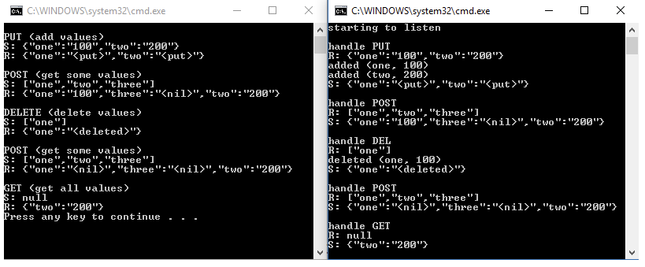

# C++ REST SDK

## 0. 참고 문헌
*- [cpprestsdk github pages](https://github.com/microsoft/cpprestsdk)*

*- [cpprestsdk API](https://microsoft.github.io/cpprestsdk/namespaces.html)*

*- [cpprestsdk example code](https://mariusbancila.ro/blog/2017/11/19/revisited-full-fledged-client-server-example-with-c-rest-sdk-2-10/)*

*- [Modern C++ micro-service implementation + REST API - Iván Mejía](https://medium.com/@ivan.mejia/modern-c-micro-service-implementation-rest-api-b499ffeaf898)*

*- [Modern C++ micro-serivce + REST API, Part II + REST API - Iván Mejía](https://medium.com/@ivan.mejia/modern-c-micro-serivce-rest-api-part-ii-7be067440ca8)*

## 1. C++ REST SDK

C++ REST SDK는 modern asynchronous C++ API를 사용한 코드로 클라우드 기반 CLIENT-SERVER 통신을 위한 마이크로소프트 프로젝트(프로젝트명 Casablanca)이다. 이 프로젝트는 C++ 개발자들이 서비스에 접속하고 상호작용할 수 있도록 돕는 것을 목표로 한다.

C++ REST SDK의 특징은 HTTP를 이용한 Client, Server를 쉽게 구현할 수 있으며, JSON 형태를 이용한다. 또한  Windows desktop, Windows Store(UWP), Linux, OS X, Unix, iOS 및 Android 등 다양한 플랫폼에서 운영될 수 있는 크로스 플랫폼을 지원한다.

이러한 C++ REST SDK는 C++를 이용한 뛰어난 성능의 REST 애플리케이션을 쉽고 빠르게 만들 수 있도록 한다.

## 2. 예제

C++ REST SDK를 이용한 SERVER-CLIENT 예제를 ROS2로 구현한 예제([C++ REST SDK example github pages](https://github.com/whgdms1230/cpprest_example))이다.


## 2.1 SERVER

SERVER는 CLINET로부터 요청받은 명령을 `dictionary` 변수에 저장하고, 이를 이용하여 CLIENT의 요청을 처리하는 노드이다.

### 2.1.1 main 함수
* `http_listener` 객체를 생성(URI 지정)한다.
* `display_json()` 함수를 이용하여 request 처리 시 json 형태의 정보를 시각화한다.
* `support()` 함수로 request method 지정 및 handler 함수 지정한다.
* listener loop 동작시킨다.

```cpp
#include <cpprest/http_listener.h>
#include <cpprest/json.h>

using namespace web;
using namespace web::http;
using namespace web::http::experimental::listener;

#include <iostream>
#include <map>
#include <set>
#include <string>
using namespace std;

#define TRACE(msg)            cout << msg
#define TRACE_ACTION(a, k, v) cout << a << U(" (") << k << U(", ") << v << U(")\n")

map<utility::string_t, utility::string_t> dictionary;

void display_json(
   json::value const & jvalue,
   utility::string_t const & prefix)
{
   cout << prefix << jvalue.serialize() << endl;
}

int main()
{
   http_listener listener(U("http://localhost/restdemo"));

   listener.support(methods::GET, bind(&handle_get, this, std::placeholders::_1));
   listener.support(methods::POST, bind(&handle_post, this, std::placeholders::_1));
   listener.support(methods::PUT, bind(&handle_put, this, std::placeholders::_1));
   listener.support(methods::DEL, bind(&handle_del, this, std::placeholders::_1));

   try
   {
      listener
         .open()
         .then([&listener](){TRACE(L"\nstarting to listen\n");})
         .wait();

      while (true);
   }
   catch (exception const & e)
   {
      wcout << e.what() << endl;
   }

   return 0;
}
```

### 2.1.2 Method - get

#### 2.1.2.1 handle_get
* `answer` 변수에 `request`에 대한 json::value 데이터 저장한다.
* `request`에 대한 `reply()` 수행한다.

```cpp
void handle_get(http_request request)
{
   TRACE(U("\nhandle GET\n"));

   auto answer = json::value::object();

   for (auto const & p : dictionary)
   {
      answer[p.first] = json::value::string(p.second);
   }

   display_json(json::value::null(), U("R: "));
   display_json(answer, U("S: "));

   request.reply(status_codes::OK, answer);
}
```

### 2.1.3 Method - post, put, del
`POST`, `PUT`, `DEL` methods는 `GET` 방식보다 복잡한 구조로 되어있다.

#### 2.1.3.1 handle_request
* `handle_request()` 함수는 `request`된 json 값을 처리하고, `response`할 json 값을 만드는 요청을 처리하기 위한 일반적인 메소드 함수이다.
* `POST`, `PUT`, `DEL` methods handler는 `handle_request()`를 이용하여 처리한다.

```cpp
void handle_request(
   http_request request,
   function<void(json::value const &, json::value &)> action)
{
   auto answer = json::value::object();

   request
      .extract_json()
      .then([&answer, &action](pplx::task<json::value> task) {
         try
         {
            auto const & jvalue = task.get();
            display_json(jvalue, U("R: "));

            if (!jvalue.is_null())
            {
               action(jvalue, answer);
            }
         }
         catch (http_exception const & e)
         {
            wcout << e.what() << endl;
         }
      })
      .wait();

   
   display_json(answer, U("S: "));

   request.reply(status_codes::OK, answer);
}
```

#### 2.1.3.2 handle_post

```cpp
void handle_post(http_request request)
{
   TRACE("\nhandle POST\n");

   handle_request(
      request,
      [](json::value const & jvalue, json::value & answer)
   {
      for (auto const & e : jvalue.as_array())
      {
         if (e.is_string())
         {
            auto key = e.as_string();
            auto pos = dictionary.find(key);

            if (pos == dictionary.end())
            {
               answer[key] = json::value::string(U("<nil>"));
            }
            else
            {
               answer[pos->first] = json::value::string(pos->second);
            }
         }
      }
   });
}
```

#### 2.1.3.3 handle_put

```cpp
void handle_put(http_request request)
{
   TRACE("\nhandle PUT\n");

   handle_request(
      request,
      [](json::value const & jvalue, json::value & answer)
   {
      for (auto const & e : jvalue.as_object())
      {
         if (e.second.is_string())
         {
            auto key = e.first;
            auto value = e.second.as_string();

            if (dictionary.find(key) == dictionary.end())
            {
               TRACE_ACTION(U("added"), key, value);
               answer[key] = json::value::string(U("<put>"));
            }
            else
            {
               TRACE_ACTION(U("updated"), key, value);
               answer[key] = json::value::string(U("<updated>"));
            }

            dictionary[key] = value;
         }
      }
   });
}
```

#### 2.1.3.4 handle_del

```cpp
void handle_del(http_request request)
{
   TRACE("\nhandle DEL\n");

   handle_request(
      request,
      [](json::value const & jvalue, json::value & answer)
   {
      set<utility::string_t> keys;
      for (auto const & e : jvalue.as_array())
      {
         if (e.is_string())
         {
            auto key = e.as_string();

            auto pos = dictionary.find(key);
            if (pos == dictionary.end())
            {
               answer[key] = json::value::string(U("<failed>"));
            }
            else
            {
               TRACE_ACTION(U("deleted"), pos->first, pos->second);
               answer[key] = json::value::string(U("<deleted>"));
               keys.insert(key);
            }
         }
      }

      for (auto const & key : keys)
         dictionary.erase(key);
   });
}
```

## 2.2 Client
* HTTP request를 만드는 `http_client` 객체를 생성한다.
* request method, path 및 json 값을 지정할 수 있는 오버로드 된 `make_request()` 함수를 가진다.
* `make_request()`의 경우 reqeust를 디스패치하고, 받은 response를 콘솔에 표시하는 역할을 한다.
* `GET` 매소드의 경우 json 값을 보내지 않는다.

```cpp
#include <cpprest/http_client.h>
#include <cpprest/json.h>

using namespace web;
using namespace web::http;
using namespace web::http::client;

#include <iostream>
using namespace std;

void display_json(
   json::value const & jvalue, 
   utility::string_t const & prefix)
{
   cout << prefix << jvalue.serialize() << endl;
}

pplx::task<http_response> make_task_request(
   http_client & client,
   method mtd,
   uri_builder builder,
   json::value const & jvalue)
{
   return (mtd == methods::GET || mtd == methods::HEAD) ?
      client.request(mtd, builder.to_string()) :
      client.request(mtd, builder.to_string(), jvalue);
}

void make_request(
   http_client & client,
   method mtd,
   uri_builder builder,
   json::value const & jvalue)
{
   make_task_request(client, mtd, builder, jvalue)
      .then([](http_response response)
      {
         if (response.status_code() == status_codes::OK)
         {
               return response.extract_json();
         }
         return pplx::task_from_result(json::value());
      })
      .then([](pplx::task<json::value> previousTask)
      {
         try
         {
               display_json(previousTask.get(), U("R: "));
         }
         catch (http_exception const & e)
         {
               cout << e.what() << endl;
         }
      })
      .wait();
}

int main()
{
   http_client client(U("http://localhost:9090"));
   uri_builder builder(U("/restdemo"));

   auto putvalue = json::value::object();
   putvalue[U("one")] = json::value::string(U("100"));
   putvalue[U("two")] = json::value::string(U("200"));

   cout << U("\nPUT (add values)\n");
   display_json(putvalue, U("S: "));
   make_request(client, methods::PUT, builder, putvalue);

   auto getvalue = json::value::array();
   getvalue[0] = json::value::string(U("one"));
   getvalue[1] = json::value::string(U("two"));
   getvalue[2] = json::value::string(U("three"));

   cout << U("\nPOST (get some values)\n");
   display_json(getvalue, U("S: "));
   make_request(client, methods::POST, builder, getvalue);

   auto delvalue = json::value::array();
   delvalue[0] = json::value::string(U("one"));

   cout << U("\nDELETE (delete values)\n");
   display_json(delvalue, U("S: "));
   make_request(client, methods::DEL, builder, delvalue);

   cout << U("\nPOST (get some values)\n");
   display_json(getvalue, U("S: "));
   make_request(client, methods::POST, builder, getvalue);

   auto nullvalue = json::value::null();

   cout << U("\nGET (get all values)\n");
   display_json(nullvalue, U("S: "));
   make_request(client, methods::GET, builder, nullvalue);

   return 0;
}
```

## 2.3 Result

