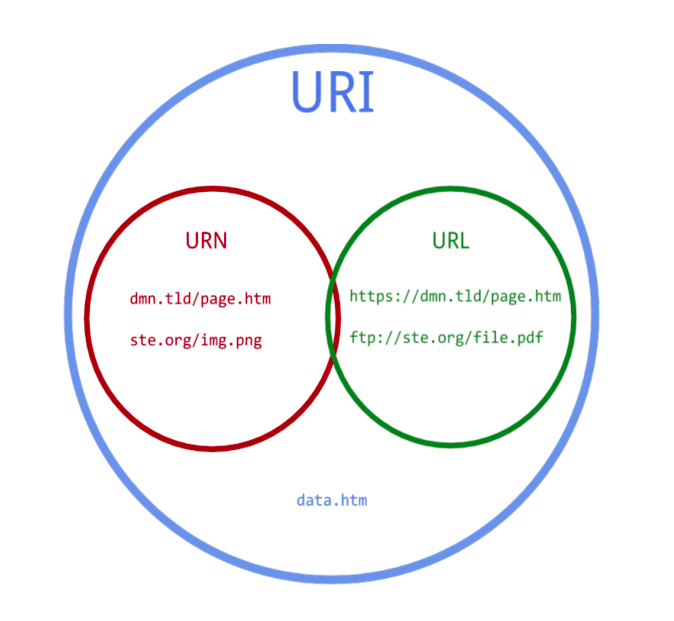
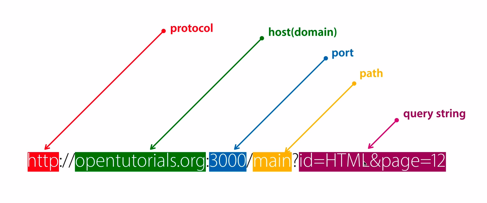

# REST API URI/URL/URN

*- [URI URL URN이 무엇인가? (REST API를 공부하기 위하여)](https://backhero.tistory.com/7)*

## URI

URI이란..

* Uniform Resource Identifier, 통합 자원 식별자의 줄임말이다.
* scheme, hosts, url-path에 더해 query, bookmark를 포함한다.
* URI의 하위 개념으로 URL과 URN이 있다.

* scheme : 통신 방식(프로토콜)을 결정. 웹 브라우저에서는 http(s)를 사용
* hosts : 웹 서버의 이름, 도메인, IP를 사용하여 주소를 나타냄
* url-path : 웹 서버에서 지정한 루트 디렉터리부터 시작하여 웹 페이지, 이미지, 동영상 등이 위치한 경로와 파일명을 나타냄
* query : 웹 서버에 보내는 추가적인 질문

## URL

URL이란..

* Uniform Resource Locator의 줄임말이다.
* 네트워크 상에서 웹 페이지, 이미지, 동영상 등의 파일이 위치한 정보를 나타낸다.
* scheme, hosts, url-path까지만 포함한 것이다.
* FTP, SMTP 등 다른 프로토콜에서도 사용할 수 있다.
* 웹 상의 주소를 나타내는 문자열이기 때문에 더 효율적으로 리소스에 접근하기 위해 클린한 URL 작성을 위한 방법론들이 생겨났는데 REST API도 그 중 하나이다.

즉, URL은 URI에 속하며, URL 뒤에 query가 붙으면 URI이다.

> URL은 자원의 위치이고, URI는 자원의 식별자다.

## URN

URN이란..

* Uniform Resource Name의 줄임말이다.
* URL의 표준 포맷 중 하나로, 이름으로 리소스를 특정하는 URI이다.
* http와 같은 프로토콜을 제외하고 리소스의 name을 가리키는 데 사용된다.
* 리소스를 영구적이고 유일하게 식별할 수 있는 URI이다.
* 리소스 접근방법과, 웹 상의 위치가 표기되지 않는다.
* 리소스 자체에 부여된 영구적이고 유일한 이름이고 변하지 않는다.
* 실제 자원을 찾기 위해서는 URN을 URL로 변환하여 이용한다.

간단하게 말하면 인터넷 상에서 어떤 자원을 식별할 때 자원의 이름을 활용하여 특정 자원을 식별하겠다는 뜻이다.

여기서 자원의 이름은 특정 자원을 얻을 수 있는 위치 정보를 포함하지 않고 자원의 위치에 상관없이 고유한 이름만으로 특정 자원을 식별할 수 있다 즉 자원 간에 이름 중복이 발생하지 않는 값이어야 한다.