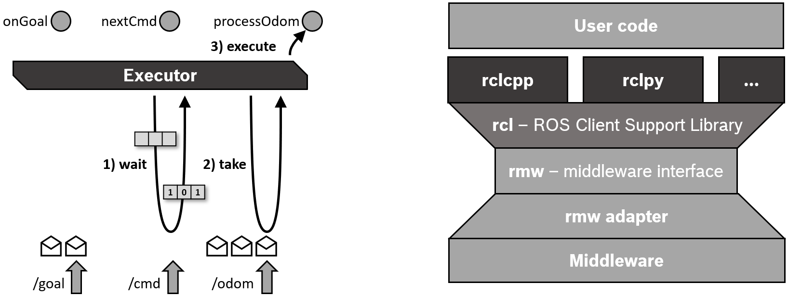

# ROS2 Executors

* [Executors docs](https://docs.ros.org/en/foxy/Concepts/About-Executors.html)

ROS2의 실행 관리는 Executor들을 통해 이루어진다. Executor는 하나 혹은 그 이상의 스레드를 이용하여, `Subscription`, `Timer`, `Service Server`, `Action Server` 등의 callback 함수를 호출하는데 사용된다. 명시적 Executor 클래스([executor.hpp](https://papago.naver.net/apis/site/proxy?url=https%3A%2F%2Fgithub.com%2Fros2%2Frclcpp%2Fblob%2Fmaster%2Frclcpp%2Finclude%2Frclcpp%2Fexecutor.hpp) or [executors.py](https://papago.naver.net/apis/site/proxy?url=https%3A%2F%2Fgithub.com%2Fros2%2Frclpy%2Fblob%2Fmaster%2Frclpy%2Frclpy%2Fexecutors.py))는 ROS 1의 spin 매커니즘보다 많은 관리 기능을 제공한다.

다음은 `Single-Threaded Executor`를 이용하여 node를 추가하고, `spin`하는 코드이다.

```cpp
int main(int argc, char* argv[]){

  // Some initialization.
  rclcpp::init(argc, argv);
  
  // Instantiate a node.
  rclcpp::executors::SingleThreadedExecutor executor;

  rclcpp::Node::SharedPtr node = ...     
  executor.add_node(node);

  // Run the executor.
  executor.spin();
  
  // Shutdown and exit.
  rclcpp::shutdown();
  return 0;
} 
```

executor를 `spin()` 함으로써 쓰레드 동작이 시작되고, 해당 쓰레드는 수신 메시지 및 기타 이벤트에 대해 rcl 및 미들웨어 계층을 쿼리하고, 노드가 종료될 때까지 해당하는 콜백 기능들을 호출한다.

미들웨어의 QoS 설정을 상쇄하지 않기 위해, 수신 메시지는 클라이언트 라이브러리 계층의 대기열에 저장되지 않고 콜백 함수에 의해 처리될 때까지 미들웨어에 보관된다.(이것은 ROS 1과의 중요한 차이점이다.)

`wait set`은 미들웨어 계층에서 사용 가능한 메시지를 실행자에게 알리기위해 사용되며, 대기열당 1개의 이진 플래그를 가진다.



`Single-Threaded Executor`는 명시적인 주 기능 없이 노드를 생성하고 실행하는 모든 경우에 사용된다.

##### 실행자 유형

rclcpp는 세 가지 실행자 유형을 제공한다.

* SingleThreadedExecutor
* MultiThreadedExecutor : 여러 메시지 또는 이벤트를 병렬로 처리할 수 있도록 여러 개의 쓰레드를 생성한다.
* StaticSingleThreadedExecutor : `Subscription`, `Timer`, `Service Server`, `Action Server` 등의 노드 구조를 검색하기 위한 런타임 비용을 최적화한다. 노드가 추가될 때 이 검색은 한 번만 수행한다.(Single, Multi 실행자는 변경사항을 정기적으로 검사한다.) 따라서 정적 단일 쓰레드 실행자는 초기화 중에 생성하는 노드에만 사용해야 한다.

다음은 `MultiThreadedExecutor`에 세 개의 노드를 추가하는 것을 보여준다.

```cpp
rclcpp::Node::SharedPtr node1 = ...
rclcpp::Node::SharedPtr node2 = ...
rclcpp::Node::SharedPtr node3 = ...

rclcpp::executors::MultiThreadedExecutor executor;

executor.add_node(node1);
executor.add_node(node2);
executor.add_node(node2);
executor.spin();
```

다음은 `StaticSingleThreadedExecutor`에 세 개의 노드를 추가하는 것을 보여준다.

```cpp
rclcpp::Node::SharedPtr node1 = ...
rclcpp::Node::SharedPtr node2 = ...
rclcpp::Node::SharedPtr node3 = ...

rclcpp::executors::StaticSingleThreadedExecutor executor;

executor.add_node(node1);
executor.add_node(node2);
executor.add_node(node2);
executor.spin(); 
```

## Callback 그룹

ROS2 노드를 사용하여 Callback을 그룹으로 만들 수 있다. rclcpp에서는 create_callback_group 함수를 이용하여 Callback 그룹을 생성할 수 있다.

Callback 그룹은 Subscription, Timer 등을 만들 때 지정할 수 있다.

Callback 그룹은 두 가지 타입이 있다.

* Mutually exclusive: Callback 그룹이 병렬로 실행되지 않음
* Reentrant: Callback 그룹이 병렬로 실행될 수 있음

##### Subscription Callback 그룹

```cpp
subscription_callback_group = create_callback_group(rclcpp::CallbackGroupType::MutuallyExclusive);
rclcpp::SubscriptionOptions options;
options.callback_group = subscription_callback_group;
my_subscription = create_subscription<Int32>("/topic_name", rclcpp::SensorDataQoS(), std::bind(callback_function, this), options); 
```

##### Timer Callback 그룹

```cpp
#include <chrono>
using namespace std::chrono_literals;

timer_callback_group = create_callback_group(rclcpp::CallbackGroupType::MutuallyExclusive);
my_timer = create_wall_timer(std::chrono_literals::100ms, std::bind(callback_function, this), timer_callback_group);
```

내용 추가 작성 필요
