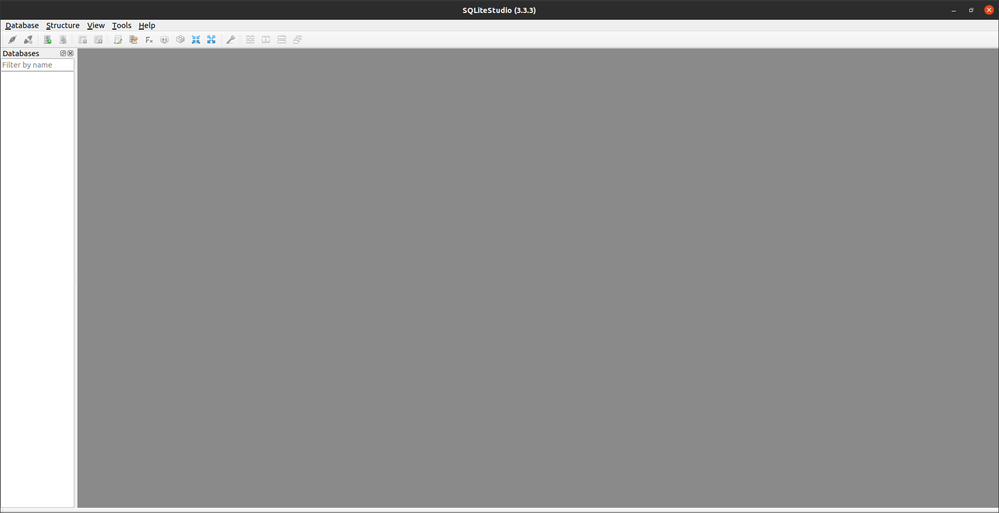

# SQLite

## 0. 참고 문헌

*- [sqlite 홈페이지](https://www.sqlite.org/index.html)*

*- [SQLite3로 가볍게 배우는 데이터베이스: SQL 기초 실습](https://wikidocs.net/book/1530)*

*- [sqlite3 C++ API](https://www.sqlite.org/cintro.html)*

*- [sqlite3 C/C++ tutorials](https://www.tutorialspoint.com/sqlite/sqlite_c_cpp.htm)*


## 1. SQLite란?
SQLite는 가장 널리 사용되는 데이터베이스 엔진으로, 임베디드 디바이스, 사물 인터넷, 데이터 분석, 작은 규모의 웹사이트에 사용하기 적합하다.

SQLite의 특징은 다음과 같다.

* SQLite는 임베디드 SQL 데이터베이스 엔진으로, 독립적인 서버 프로세스를 갖지 않는다.
* 설치 과정이 없고, 설정 파일도 존재하지 않는다.
* 테이블, 인덱스, 트리거, 뷰 등을 포함한 완전한 데이터베이스가 디스크 상에 단 하나의 파일로 존재한다.
* 퍼블릭 도메인5으로서 개인적 또는 상업적 목적으로 사용할 수 있다.

## 2. SQLite 설치

SQLite3 설치방법은 다음과 같다.

```bash
sudo apt-get install sqlite3
```

설치가 완료되면 다음의 명령으로 설치를 확인할 수 있다.

```bash
sqlite3
```

[SQLite Studio 설치 페이지](https://sqlitestudio.pl/)에서 SQLite Studio를 설치한다. 설치 후 압축 파일의 압축을 해제하고, 설치된 폴더에서 다음의 명령을 수행하면 SQLite Studio가 실행된다.

```bash
./sqlitestduio
```



## 3. Tutorials

### 3.1 Connect to Database
다음은 `test.db`라는 데이터베이스 파일을 open하여 연결하는 예제 코드이다.
```cpp
#include <stdio.h>
#include <sqlite3.h> 

int main(int argc, char* argv[]) {
   sqlite3 *db;
   char *zErrMsg = 0;
   int rc;

   rc = sqlite3_open("test.db", &db);

   if( rc ) {
      fprintf(stderr, "Can't open database: %s\n", sqlite3_errmsg(db));
      return(0);
   } else {
      fprintf(stderr, "Opened database successfully\n");
   }
   sqlite3_close(db);
}
```

### 3.2 Create a Table
다음은 `test.db` 파일에 테이블을 `CREATE` 하는 예제 코드이다.
sql을 보면, `CREATE TABLE`이라는 명령을 이용하여 `COMPANY`라는 테이블을 만들고 있음을 알 수 있다. 해당 테이블에는 `INT`형 `PRIMERY KEY`인 `ID`, `TEXT`인 `NAME`, `INT`형 `AGE`, 길이가 50인 `CHAR`형 `ADDRESS`, float 형태인 `REAL`인 `SALARY`을 항목으로 가진다.
```cpp
#include <stdio.h>
#include <stdlib.h>
#include <sqlite3.h> 

static int callback(void *NotUsed, int argc, char **argv, char **azColName) {
   int i;
   for(i = 0; i<argc; i++) {
      printf("%s = %s\n", azColName[i], argv[i] ? argv[i] : "NULL");
   }
   printf("\n");
   return 0;
}

int main(int argc, char* argv[]) {
   sqlite3 *db;
   char *zErrMsg = 0;
   int rc;
   char *sql;

   /* Open database */
   rc = sqlite3_open("test.db", &db);
   
   if( rc ) {
      fprintf(stderr, "Can't open database: %s\n", sqlite3_errmsg(db));
      return(0);
   } else {
      fprintf(stdout, "Opened database successfully\n");
   }

   /* Create SQL statement */
   sql = "CREATE TABLE COMPANY("  \
      "ID INT PRIMARY KEY     NOT NULL," \
      "NAME           TEXT    NOT NULL," \
      "AGE            INT     NOT NULL," \
      "ADDRESS        CHAR(50)," \
      "SALARY         REAL );";

   /* Execute SQL statement */
   rc = sqlite3_exec(db, sql, callback, 0, &zErrMsg);
   
   if( rc != SQLITE_OK ){
      fprintf(stderr, "SQL error: %s\n", zErrMsg);
      sqlite3_free(zErrMsg);
   } else {
      fprintf(stdout, "Table created successfully\n");
   }
   sqlite3_close(db);
   return 0;
}
```

### 3.3 INSERT Operation
다음은 `test.db`에 새로운 값을 추가(`INSERT`)하는 예제이다. sql을 보면, `COMPANY` 테이블에 `INSERT`를 하는데, `ID`, `NAME`, `AGE`, `ADDRESS`, `SALARY` 항목을 묶어서 추가하는 것을 알 수 있다.

```cpp
#include <stdio.h>
#include <stdlib.h>
#include <sqlite3.h> 

static int callback(void *NotUsed, int argc, char **argv, char **azColName) {
   int i;
   for(i = 0; i<argc; i++) {
      printf("%s = %s\n", azColName[i], argv[i] ? argv[i] : "NULL");
   }
   printf("\n");
   return 0;
}

int main(int argc, char* argv[]) {
   sqlite3 *db;
   char *zErrMsg = 0;
   int rc;
   char *sql;

   /* Open database */
   rc = sqlite3_open("test.db", &db);
   
   if( rc ) {
      fprintf(stderr, "Can't open database: %s\n", sqlite3_errmsg(db));
      return(0);
   } else {
      fprintf(stderr, "Opened database successfully\n");
   }

   /* Create SQL statement */
   sql = "INSERT INTO COMPANY (ID,NAME,AGE,ADDRESS,SALARY) "  \
         "VALUES (1, 'Paul', 32, 'California', 20000.00 ); " \
         "INSERT INTO COMPANY (ID,NAME,AGE,ADDRESS,SALARY) "  \
         "VALUES (2, 'Allen', 25, 'Texas', 15000.00 ); "     \
         "INSERT INTO COMPANY (ID,NAME,AGE,ADDRESS,SALARY)" \
         "VALUES (3, 'Teddy', 23, 'Norway', 20000.00 );" \
         "INSERT INTO COMPANY (ID,NAME,AGE,ADDRESS,SALARY)" \
         "VALUES (4, 'Mark', 25, 'Rich-Mond ', 65000.00 );";

   /* Execute SQL statement */
   rc = sqlite3_exec(db, sql, callback, 0, &zErrMsg);
   
   if( rc != SQLITE_OK ){
      fprintf(stderr, "SQL error: %s\n", zErrMsg);
      sqlite3_free(zErrMsg);
   } else {
      fprintf(stdout, "Records created successfully\n");
   }
   sqlite3_close(db);
   return 0;
}

```

### 3.4 SELECT Operation
`SELECT`는 테이블의 영역을 선택하는 것으로 여기서는 `test.db`의 `COMPANY` 테이블의 데이터를 가져온다. 또한 `callback()` 함수를 이용하여 가져온 데이터를 콘솔창에 띄워준다.

```cpp
#include <stdio.h>
#include <stdlib.h>
#include <sqlite3.h> 

static int callback(void *data, int argc, char **argv, char **azColName){
   int i;
   fprintf(stderr, "%s: ", (const char*)data);
   
   for(i = 0; i<argc; i++){
      printf("%s = %s\n", azColName[i], argv[i] ? argv[i] : "NULL");
   }
   
   printf("\n");
   return 0;
}

int main(int argc, char* argv[]) {
   sqlite3 *db;
   char *zErrMsg = 0;
   int rc;
   char *sql;
   const char* data = "Callback function called";

   /* Open database */
   rc = sqlite3_open("test.db", &db);
   
   if( rc ) {
      fprintf(stderr, "Can't open database: %s\n", sqlite3_errmsg(db));
      return(0);
   } else {
      fprintf(stderr, "Opened database successfully\n");
   }

   /* Create SQL statement */
   sql = "SELECT * from COMPANY";

   /* Execute SQL statement */
   rc = sqlite3_exec(db, sql, callback, (void*)data, &zErrMsg);
   
   if( rc != SQLITE_OK ) {
      fprintf(stderr, "SQL error: %s\n", zErrMsg);
      sqlite3_free(zErrMsg);
   } else {
      fprintf(stdout, "Operation done successfully\n");
   }
   sqlite3_close(db);
   return 0;
}
```

### 3.5 UPDATE Operation
`UPDATE` 기존 TABLE에 있는 항목을 최신화하기 위해 사용된다. 다음은 `test.db`의 `COMPANY` 테이블을 업데이트 하는 예제이다. 여기서는 `ID`가 1번인 항목에서 `SALARY` 값을 변경시킨다.

```cpp
#include <stdio.h>
#include <stdlib.h>
#include <sqlite3.h> 

static int callback(void *data, int argc, char **argv, char **azColName){
   int i;
   fprintf(stderr, "%s: ", (const char*)data);
   
   for(i = 0; i<argc; i++) {
      printf("%s = %s\n", azColName[i], argv[i] ? argv[i] : "NULL");
   }
   printf("\n");
   return 0;
}

int main(int argc, char* argv[]) {
   sqlite3 *db;
   char *zErrMsg = 0;
   int rc;
   char *sql;
   const char* data = "Callback function called";

   /* Open database */
   rc = sqlite3_open("test.db", &db);
   
   if( rc ) {
      fprintf(stderr, "Can't open database: %s\n", sqlite3_errmsg(db));
      return(0);
   } else {
      fprintf(stderr, "Opened database successfully\n");
   }

   /* Create merged SQL statement */
   sql = "UPDATE COMPANY set SALARY = 25000.00 where ID=1; " \
         "SELECT * from COMPANY";

   /* Execute SQL statement */
   rc = sqlite3_exec(db, sql, callback, (void*)data, &zErrMsg);
   
   if( rc != SQLITE_OK ) {
      fprintf(stderr, "SQL error: %s\n", zErrMsg);
      sqlite3_free(zErrMsg);
   } else {
      fprintf(stdout, "Operation done successfully\n");
   }
   sqlite3_close(db);
   return 0;
}
```

### 3.6 DELETE Operation
`DELETE`는 테이블에서 특정 데이터 값을 삭제시키는 동작이며, 해당 예제는 `test.db`의 `COMPANY`테이블에서 `ID`가 2인 데이터를 삭제하는 예제이다.
```cpp
#include <stdio.h>
#include <stdlib.h>
#include <sqlite3.h> 

static int callback(void *data, int argc, char **argv, char **azColName) {
   int i;
   fprintf(stderr, "%s: ", (const char*)data);
   
   for(i = 0; i<argc; i++) {
      printf("%s = %s\n", azColName[i], argv[i] ? argv[i] : "NULL");
   }
   printf("\n");
   return 0;
}

int main(int argc, char* argv[]) {
   sqlite3 *db;
   char *zErrMsg = 0;
   int rc;
   char *sql;
   const char* data = "Callback function called";

   /* Open database */
   rc = sqlite3_open("test.db", &db);
   
   if( rc ) {
      fprintf(stderr, "Can't open database: %s\n", sqlite3_errmsg(db));
      return(0);
   } else {
      fprintf(stderr, "Opened database successfully\n");
   }

   /* Create merged SQL statement */
   sql = "DELETE from COMPANY where ID=2; " \
         "SELECT * from COMPANY";

   /* Execute SQL statement */
   rc = sqlite3_exec(db, sql, callback, (void*)data, &zErrMsg);
   
   if( rc != SQLITE_OK ) {
      fprintf(stderr, "SQL error: %s\n", zErrMsg);
      sqlite3_free(zErrMsg);
   } else {
      fprintf(stdout, "Operation done successfully\n");
   }
   sqlite3_close(db);
   return 0;
}
```