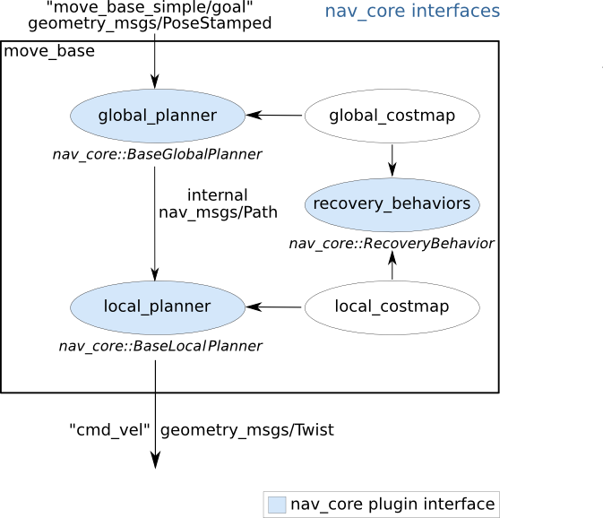

# nav_core

## 0. 참고 문헌

*- [nav_core 위키 페이지](http://wiki.ros.org/nav_core)*

## 1. nav_core 개요

nav_core는 navigation을 구현하기 위한 기본 인터페이스를 제공한다.
nav_core에서 제공하는 인터페이스는 다음과 같다.

* BaseGlobalPlanner
* BaseLocalPlanner
* RecoveryBehavior

이 인터페이스를 기반으로 move_base 노드에 새로운 글로벌 플래너, 로컬플래너, 리커버리를 구현할 수 있다.

## 2. BaseGlobalPlanner
nav_core::BaseGlobalPlanner는 글로벌 플래너를 위한 기본 인터페이스를 제공한다. nav_core::BaseGlobalPlanner 인터페이스로 구현되어 제공되는 글로버 플래너는 다음과 같다.

* [carrot_planner/CarrotPlanner](http://wiki.ros.org/carrot_planner) : 가장 단순한 플래너로 목표지점과 가장 가까이 이동하도록 만드는 플래너로, 목표 지점에 장애물이 있는 경우에도 동작한다.
* [navfn/NavfnROS](http://wiki.ros.org/navfn) : 탐색 함수를 이용한 그리드 기반 글로벌 플래너
* [global_planner/GloberPlanner](http://wiki.ros.org/global_planner) : navfn을 보다 유연하게 구현한 플래너로, 기본적인 글로벌 플래너 중에서 가장 많이 사용된다.

> [BaseGlobalPlanner C++ API doc](https://docs.ros.org/en/api/nav_core/html/classnav__core_1_1BaseGlobalPlanner.html)

## 3. BaseLocalPlanner
nav_core::BaseLocalPlanner는 로컬 플래너를 위한 기본 인터페이스를 제공한다. nav_core::BaseLocalPlanner 인터페이스로 구현되어 제공되는 대표적인 로컬 플래너는 다음과 같다.

* [base_local_planner](http://wiki.ros.org/base_local_planner) : Dynamic Window Approach(DWA) 및 Trajectory Rollout Approach 구현을 제공한다.
* [dwa_local_planner](http://wiki.ros.org/dwa_local_planner) : base_local_planner의 DWA 보다 구현이 깔끔하고, 쉬운 인터페이스를 제공하고, y축 변수를 가짐으로서 더 유연한 형태의 플래너
* 그 이외의 로컬 플래너 : [eband_local_planner](http://wiki.ros.org/eband_local_planner), [teb_local_planner](http://wiki.ros.org/teb_local_planner), [mpc_local_planner](http://wiki.ros.org/mpc_local_planner)

> [BaseLocalPlanner C++ API doc](https://docs.ros.org/en/api/nav_core/html/classnav__core_1_1BaseLocalPlanner.html)

## 4. RecoveryBehavior
nav_core::RecoveryBehavior는 탐색 복구 동작을 위한 기본 인터페이스를 제공한다. nav_core::RecoveryBehavior 인터페이스로 구현되어 제공되는 recovery behavior는 다음과 같다.

* [clear_costmap_recovery](http://wiki.ros.org/clear_costmap_recovery) : cost map을 static map으로 되돌린다. 
* [rotate_recovery](http://wiki.ros.org/rotate_recovery) : 로봇을 360도 회전시켜 현재 공간의 cost를 비운다.