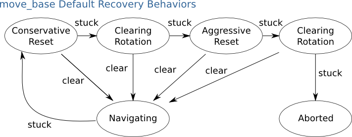

# DefaultRecoveryBehavior

## 0. 참고 문헌

*- [move_base 위키 페이지](http://wiki.ros.org/move_base)*

## 1. DefaultRecoveryBehavior

로봇이 move_base 노드를 통해 주행하는 도중에, 어떠한 상황에 의해서 로봇 주변의 코스트를 확인했을 때, 고착 상태에 빠졌다고 판단하는 경우 Recovery 동작을 수행한다. 다음은 move_base에서 사용되는 기본적인 Recovery 동작이다.

다음의 과정 중 Recovery가 되면 Navigation을 지속 수행하고, 아니라면 다음 Recovery 동작을 수행한다.

1. Conservative Reset : 사용자가 지정한 영역(~conservative_reset_dist)의 장애물 코스트를 지움.
2. Cleaning Rotation : 제자리 회전을 통해 로봇 주변의 코스트를 지움.
3. Aggresive Reset : 제자리 회전을 할 수 있도록 ~/local_costmap/circumscribed_radius의 4배 영역의 장애물 코스트를 지움.
4. Cleaning Rotation : 한번 더 제자리 회전을 통해 로봇 주변의 코스트를 지움.
5. Abort : 1~4의 동작이 모두 실패하면 Navigation 중지됨.

## 2. RecoveryBehavior Parameters
move_base의 parameter 설정 시 RecoveryBehavior의 동작 parameter를 설정할 수 있다.
1. ~recovery_behaviors : recovery를 수행 순서를 정의할 수 있으며, default 값은 위의 그림과 같은 순서이다.
2. ~conservative_reset_dist : conservative reset 시 설정할 영역의 크기
3. ~recover_behavior_enabled : recovery behavior의 활성화 여부 설정
4. ~clearing_rotation_allowed : default recovery_behaviors를 사용할 때만 사용하는 parameter로 중간의 회전을 통해 코스트를 지우는 과정을 넣거나 뺄 수 있음.